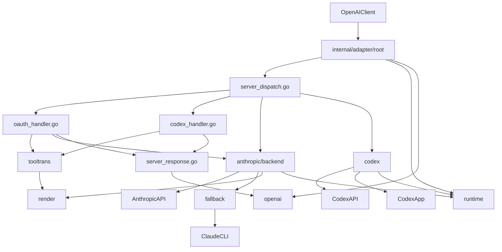
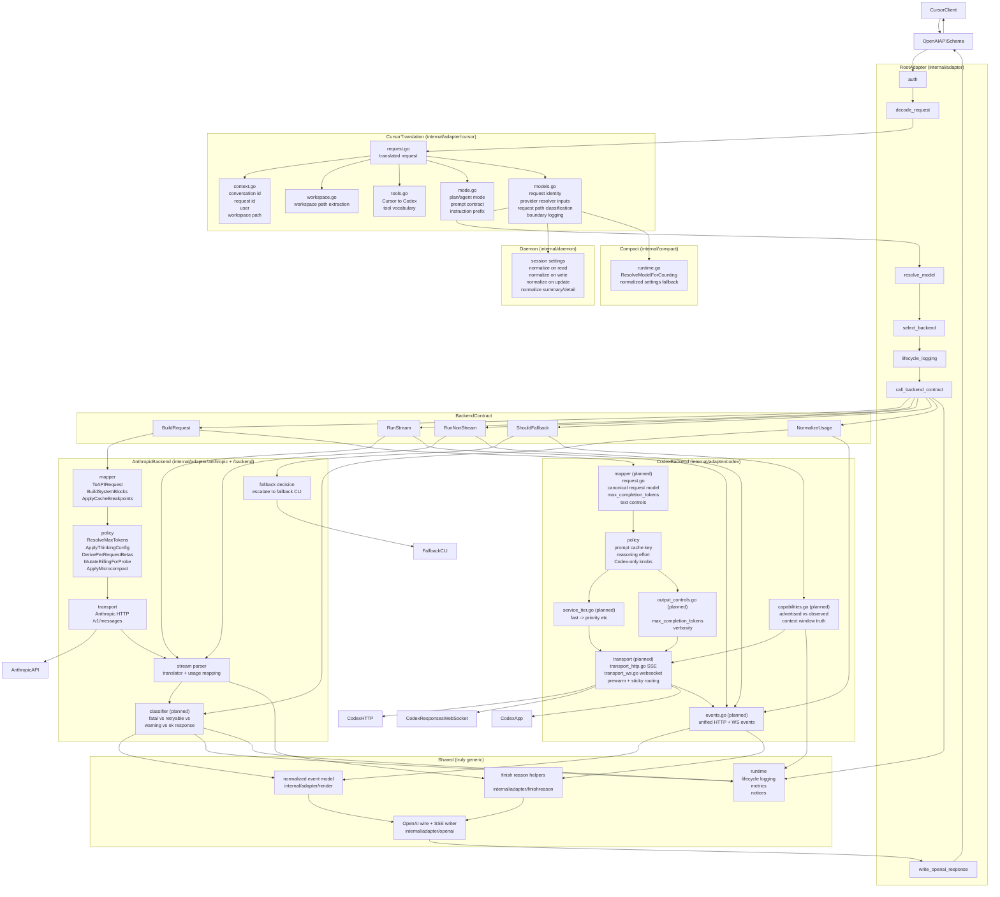
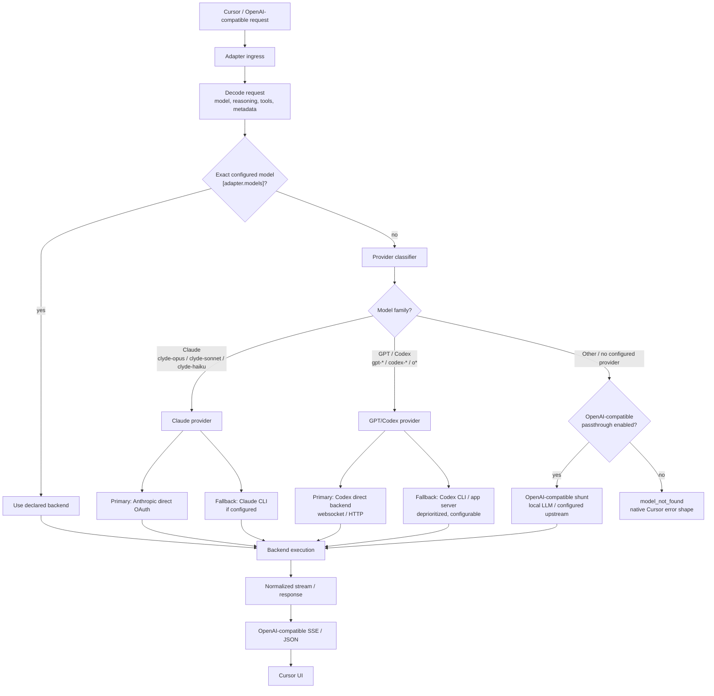

# Plan: Refactor adapter backend ownership

## Goal

Refactor `internal/adapter/` so the root adapter owns only the OpenAI HTTP
surface and backend orchestration, `internal/adapter/cursor/` owns the
Cursor-specific translation boundary, and Anthropic and Codex each own their
request shaping, transport, stream parsing, fallback policy, and normalized
response mapping.

Definition of done:

1. `internal/adapter/server_dispatch.go` can be read without seeing Anthropic
   or Codex wire-shape details.
2. Anthropic changes do not require touching Codex files, and Codex changes do
   not require touching Anthropic files.
3. Fallback behavior is backend-owned rather than root-owned.
4. Cursor-specific request translation is explicit and isolated from both root
   adapter logic and backend packages.
5. Shared packages are obviously generic: OpenAI wire types, SSE writing,
   normalized events, finish-reason mapping, and runtime logging/metrics.

## Current state

The codebase is already partway through this split, but ownership is still
mixed.

### Cursor first-class concerns

Cursor is the actual product consumer, even though the adapter accepts an
OpenAI-compatible request shape. That means the architecture should treat
Cursor as a first-class integration boundary, not as "just another OpenAI
client."

Concrete Cursor-specific behaviors already present:

- Live requests use an OpenAI-compatible JSON envelope, but often populate
  `input` heavily rather than classic `messages`.
- Cursor sends `metadata.cursorConversationId` and
  `metadata.cursorRequestId`, and the adapter already reads those exact keys in
  `internal/adapter/cursor/request.go`.
- Cursor also sends top-level `user`, which the adapter already carries into
  Cursor context.
- Cursor conversation identity is already normalized as
  `cursor:<conversationId>` in `internal/adapter/cursor/context.go`.
- That Cursor conversation ID is already used as a strong key for prompt/cache
  tracking in `internal/adapter/context_tracker.go` and Codex managed runtime
  continuity in `internal/adapter/codex/managed_runtime.go`.
- The adapter extracts `Workspace Path:` from prompt content in
  `internal/adapter/cursor/workspace.go`, scanning both flattened `messages`
  and `input`. That is a Cursor convention, not generic OpenAI semantics.
- Cursor can send tools in a flattened function shape rather than only the
  canonical nested OpenAI `function: {...}` shape.
- Cursor tool inventory includes product-specific tools such as `TodoWrite`,
  `ReadLints`, `SemanticSearch`, `Subagent`, `FetchMcpResource`,
  `SwitchMode`, `CallMcpTool`, and in plan mode `CreatePlan`.
- Cursor tool-name mapping into Codex currently lives in
  `internal/adapter/codex_handler.go` and `internal/adapter/codex/protocol.go`,
  even though those names are Cursor product vocabulary rather than backend
  vocabulary.
- Cursor plan mode injects plan-mode guardrails and a `CreatePlan` tool.
- Cursor exposes `SwitchMode` and injects mode-selection instructions that
  describe `Agent Mode` and `Plan Mode`.
- Cursor prompt content injects MCP conventions such as schema-first tool use,
  `CallMcpTool`, and `FetchMcpResource`.
- Cursor UI and catalog state can use native provider-facing model identity
  such as `gpt-5.4` plus separate UI state for context window and reasoning
  effort. Observed native Cursor GPT traffic does not send a separate `1m`
  model suffix in the request body.
- Background, resume, and subagent flows are therefore part of the Cursor
  integration boundary, because they can diverge from the foreground submit
  routing path and fail with `AI Model Not Found` or an opaque streaming error
  when provider identity, context window, or effort state is reconstructed
  differently.
- The adapter already treats `x-cursor-*` headers as sensitive.
- The adapter already contains Cursor-specific reasoning/rendering behavior
  because Cursor does not consume OpenAI reasoning fields the same way some
  other clients do.
- Several comments note that Cursor resends full history on each turn, and
  session/cache logic already relies on stable Cursor conversation identity.

### Cursor wire contract and tool inventory

The refactor should preserve the exact Cursor-facing contract we have already
observed rather than treating it as generic OpenAI traffic.

Wire/schema details to preserve:

- Cursor uses an OpenAI-compatible request envelope.
- Cursor often sends large `input` payloads rather than relying only on classic
  `messages`.
- Cursor sends `metadata.cursorConversationId`.
- Cursor sends `metadata.cursorRequestId`.
- Cursor sends top-level `user`.
- Cursor can send tools in a flattened function schema:
  `{"type":"function","name":"ReadFile","description":"...","parameters":{...}}`
  and not only the canonical nested OpenAI `function: {...}` shape.
- Cursor plan-mode requests add a `CreatePlan` tool.
- Cursor plan-mode requests inject plan-mode guardrails.
- The current Codex adapter injects the wrong plan-mode instructions, so
  plan-mode translation is not just an ownership concern. It is also a current
  correctness bug that the refactor must preserve as a known gotcha and fix in
  the Cursor layer rather than re-embedding in Codex-specific request shaping.
- Cursor mode requests inject mode-selection instructions such as `Agent Mode`
  and `Plan Mode`.
- Cursor MCP-related prompt content injects conventions around schema-first
  tool use, `CallMcpTool`, and `FetchMcpResource`.
- Cursor can select native provider model ids and carry context-window or
  effort state outside the `model` string. Clyde must preserve the raw Cursor
  model id and route through a declarative provider classifier instead of
  inventing backend preference from a custom flat alias.
- Foreground submit, background task launch, background task resume, subagent
  launch, and subagent resume must all use the same provider-classification
  inputs for model identity, context window, effort, and max-mode state.

Enumerated Cursor tool inventory observed in non-plan requests:

- `Shell`
- `Glob`
- `rg`
- `AwaitShell`
- `ReadFile`
- `Delete`
- `ApplyPatch`
- `EditNotebook`
- `TodoWrite`
- `ReadLints`
- `SemanticSearch`
- `WebSearch`
- `WebFetch`
- `AskQuestion`
- `Subagent`
- `FetchMcpResource`
- `SwitchMode`
- `CallMcpTool`

Additional tool observed in plan-mode requests:

- `CreatePlan`

Enumerated Cursor-to-Codex tool-name mappings already embedded in the adapter:

- `AwaitShell` -> `await_shell`
- `EditNotebook` -> `edit_notebook`
- `TodoWrite` -> `todo_write`
- `ReadLints` -> `read_lints`
- `SemanticSearch` -> `semantic_search`
- `Subagent` -> `spawn_agent`
- `FetchMcpResource` -> `fetch_mcp_resource`
- `SwitchMode` -> `switch_mode`
- `CallMcpTool` -> `call_mcp_tool`
- plus shared file/shell tools such as `ReadFile`, `ApplyPatch`, `Glob`, `rg`,
  and `Shell`

Architectural implication:

- This enumerated tool vocabulary should be treated as Cursor product
  vocabulary.
- The Cursor layer should own translation between Cursor tool naming/contracts
  and backend-local naming/contracts.
- The Cursor layer should own correct plan-mode instruction injection, because
  the current Codex adapter behavior is already known to be wrong here.
- The Cursor layer should preserve raw Cursor model identity and request state,
  then hand those fields to the shared provider resolver without encoding
  backend preference into custom flat aliases.
- Cursor boundary logging should record the raw model id, classified provider
  family, selected backend route, context-window state, effort state,
  request-path kind, raw tool names, and any derived mode/tool state so future
  Cursor contract mismatches can be debugged without backend-local logs.
- Backend packages should consume translated tool semantics where possible,
  rather than depending directly on Cursor product names.

Architectural consequence:

1. `internal/adapter/cursor/...` should be a true product-integration
   boundary.
2. Cursor prompt, mode, tool, and context quirks should move there.
3. Backend modules should stay independent of Cursor naming where possible.
4. Cursor tool names and UX contracts should be translated at the Cursor layer,
   not deep in backend code.

### Research sources

The refactor should stay grounded in observed live traffic, current adapter
implementation, and local research trees rather than relying only on the target
architecture.

Observed Cursor model/routing mismatch to preserve as a first-class refactor
input:

- Cursor native GPT selection can render as `GPT-5.4 1M High` while the request
  body carries `model: "gpt-5.4"` plus reasoning state such as
  `reasoning.effort: "high"`.
- Earlier Clyde-specific `clyde-gpt-*` flat aliases are a migration hazard, not
  the target architecture. They should not be the primary Codex/GPT routing
  mechanism once native Cursor model identity is supported.
- Live requests do expose a real `Subagent` tool, so subagent failures in this
  class are not evidence of a missing ingress tool. They are evidence of Cursor
  contract or state mismatch.
- Architecturally, this is a Cursor product-integration issue rather than a
  Codex backend issue, and it should not be fixed by teaching backend-local
  packages about Cursor catalog or UI naming.

Live observed requests:

- Raw adapter request log:
  `~/.local/state/clyde/clyde-daemon.jsonl`
- What it contains:
  - full `adapter.chat.raw` entries
  - `body_summary`
  - truncated `body`
  - `body_b64` when captured
  - headers, model, tool list, metadata, and prompt text
- Best place to inspect:
  `~/.local/state/clyde/clyde-daemon.jsonl:1`
- This is the main source for observed Cursor request shapes, plan-mode
  prompts, tool inventories, and outbound payloads entering Clyde.

Observed Anthropic internals and wire behavior:

- Anthropic client and wire types:
  - `/Users/agoodkind/Sites/clyde-dev/clyde/internal/adapter/anthropic/client.go`
  - `/Users/agoodkind/Sites/clyde-dev/clyde/internal/adapter/anthropic/types.go`
  - `/Users/agoodkind/Sites/clyde-dev/clyde/internal/adapter/anthropic/stream_parse.go`
- Anthropic backend helpers and policy:
  - `/Users/agoodkind/Sites/clyde-dev/clyde/internal/adapter/anthropic/backend/wire_helpers.go`
  - `/Users/agoodkind/Sites/clyde-dev/clyde/internal/adapter/oauth_handler.go`
- Observed Anthropic logging:
  `~/.local/state/clyde/anthropic.jsonl`
- Best test and spec references:
  - `/Users/agoodkind/Sites/clyde-dev/clyde/internal/adapter/anthropic/anthropic_test.go`
  - `/Users/agoodkind/Sites/clyde-dev/clyde/internal/adapter/cache_breakpoints_test.go`
  - `/Users/agoodkind/Sites/clyde-dev/clyde/internal/adapter/tooltrans/stream_test.go`

Observed Codex internals and wire behavior:

- Codex request shaping:
  `/Users/agoodkind/Sites/clyde-dev/clyde/internal/adapter/codex_handler.go`
- Codex SSE and protocol parsing:
  `/Users/agoodkind/Sites/clyde-dev/clyde/internal/adapter/codex/protocol.go`
- Codex backend and runtime:
  - `/Users/agoodkind/Sites/clyde-dev/clyde/internal/adapter/codex/backend.go`
  - `/Users/agoodkind/Sites/clyde-dev/clyde/internal/adapter/codex/managed_runtime.go`
  - `/Users/agoodkind/Sites/clyde-dev/clyde/internal/adapter/codex/app_transport.go`
- Best test and spec references:
  - `/Users/agoodkind/Sites/clyde-dev/clyde/internal/adapter/codex/request_builder_test.go`
  - `/Users/agoodkind/Sites/clyde-dev/clyde/internal/adapter/codex/parser_test.go`
  - `/Users/agoodkind/Sites/clyde-dev/clyde/internal/adapter/codex/transport_ws_test.go`

Observed Cursor internals and request conventions:

- Cursor integration boundary:
  - `/Users/agoodkind/Sites/clyde-dev/clyde/internal/adapter/cursor/doc.go`
  - `/Users/agoodkind/Sites/clyde-dev/clyde/internal/adapter/cursor/request.go`
  - `/Users/agoodkind/Sites/clyde-dev/clyde/internal/adapter/cursor/context.go`
  - `/Users/agoodkind/Sites/clyde-dev/clyde/internal/adapter/cursor/workspace.go`
- Cursor-specific decoding and tests:
  `/Users/agoodkind/Sites/clyde-dev/clyde/internal/adapter/openai_tool_decode_test.go`
- Observed Cursor live payloads:
  `~/.local/state/clyde/clyde-daemon.jsonl`
- Useful search terms in that log:
  - `Cursor/1.0`
  - `cursorConversationId`
  - `cursorRequestId`
  - `CreatePlan`
  - `SwitchMode`
  - `TodoWrite`
  - `CallMcpTool`

Research, decompiled, and external source trees:

- Local Cursor research and decomp area:
  `/Users/agoodkind/Sites/clyde-research/`
- Earlier-referenced Cursor source and decomp workspace:
  `/Users/agoodkind/Sites/clyde-research/cursor-src-decomp/`
- These are the best places to look for:
  - model catalog merge scripts
  - product prompt text
  - client-side tool and schema definitions
  - plan mode and mode switch behavior
  - subagent resume and background task semantics

Additional local source references for the remaining Cursor-layer work:

- `/Users/agoodkind/Sites/clyde-dev/clyde/research/claude-code-source-code-full/src/tools/EnterPlanModeTool/EnterPlanModeTool.ts`
  shows plan mode as an explicit tool-driven state transition with dedicated
  tool-result instructions, not just free-form prompt text.
- `/Users/agoodkind/Sites/clyde-dev/clyde/research/claude-code-source-code-full/src/utils/toolResultStorage.ts`
  carries a dedicated `reconstructForSubagentResume(...)` path, which is
  evidence that subagent resume semantics are explicit product behavior.
- `/Users/agoodkind/Sites/clyde-dev/clyde/research/claude-code-source-code-full/src/utils/messages.ts`
  injects prior plan-file state through explicit attachments such as
  `plan_file_reference`, which suggests that plan and resume semantics belong
  in a product boundary rather than as opaque text conventions.
- `/Users/agoodkind/Sites/clyde-dev/clyde/research/codex/codex-rs/tui/src/app/background_requests.rs`
  shows background fetch/write flows as explicit app-owned event producers,
  which is the same architectural direction this Cursor extraction should
  follow.

Codex base instruction snapshots used by Clyde:

- Embedded model and base-instruction snapshot:
  `/Users/agoodkind/Sites/clyde-dev/clyde/internal/adapter/codex/codex_model_instructions.json`
- Useful for:
  - what Clyde thinks Codex supports
  - planning and tool wording
  - drift versus live Cursor requests

High-signal plan and doc history:

- Adapter package boundary:
  `/Users/agoodkind/Sites/clyde-dev/clyde/internal/adapter/doc.go`
- Prompt-caching research and history:
  `/Users/agoodkind/Sites/clyde-dev/clyde/docs/plans/adapter-prompt-caching.md`

Shortest "start here" list for future work:

1. `~/.local/state/clyde/clyde-daemon.jsonl`
2. `/Users/agoodkind/Sites/clyde-dev/clyde/internal/adapter/codex_handler.go`
3. `/Users/agoodkind/Sites/clyde-dev/clyde/internal/adapter/codex/protocol.go`
4. `/Users/agoodkind/Sites/clyde-dev/clyde/internal/adapter/oauth_handler.go`
5. `/Users/agoodkind/Sites/clyde-dev/clyde/internal/adapter/anthropic/backend/wire_helpers.go`
6. `/Users/agoodkind/Sites/clyde-dev/clyde/internal/adapter/cursor/request.go`
7. `/Users/agoodkind/Sites/clyde-dev/clyde/internal/adapter/codex/request_builder_test.go`
8. `/Users/agoodkind/Sites/clyde-dev/clyde/internal/adapter/openai_tool_decode_test.go`

### Current diagram

What is already in place:

- `internal/adapter/doc.go` already documents the intended narrow root facade.
- `internal/adapter/cursor/` already exists and owns a small amount of
  Cursor-specific metadata and workspace extraction.
- `internal/adapter/anthropic/backend/backend.go` already provides an
  Anthropic dispatcher seam around `Handle` and `Dispatch`.
- `internal/adapter/codex/backend.go` already provides a Codex dispatcher seam
  around `Dispatch`, `Collect`, and `Stream`.
- `internal/adapter/render/event_renderer.go` already owns the normalized event
  model and shared rendering layer.
- `internal/adapter/openai/sse.go` already owns the shared SSE writer.
- `internal/adapter/runtime/` already owns backend-neutral lifecycle logging,
  notices, finish handling, and cost accounting.

Where ownership still leaks:

- `internal/adapter/server_dispatch.go` still knows backend-specific dispatch
  details and special cases `anthropic`, `codex`, `fallback`, and `shunt`.
- `internal/adapter/oauth_handler.go` still constructs Anthropic wire requests,
  applies Anthropic prompt policy, sets thinking config, and chooses
  Anthropic-specific betas.
- `internal/adapter/server_response.go` still assembles final Anthropic/Codex
  OpenAI responses from accumulated chunks in the root package.
- Cursor-specific translation is still implicit rather than first-class:
  `server_dispatch.go`, `context_tracker.go`, `codex_sessions.go`, and
  `codex_handler.go` each derive parts of Cursor context separately.
- `internal/adapter/codex_handler.go` still owns Codex request shaping,
  reasoning policy, tool alias mapping, tool spec generation, direct transport,
  and SSE parsing wrappers.
- `internal/adapter/anthropic/backend/fallback_runtime.go` now owns the
  Anthropic fallback entrypoint. The root package still exposes narrow bridge
  methods for semaphore/config access, but `internal/adapter/fallback_handler.go`
  has been deleted.
- `internal/adapter/tooltrans/` still mixes truly shared compatibility helpers
  with Anthropic-specific translation behavior.

## Target package ownership

### Proposed diagram

Diagram legend:

- Items annotated `(planned)` correspond to backend deliverables that are
  documented in the workstreams above but are not yet implemented.
- The `Cursor` subgraph represents the actual files in
  `internal/adapter/cursor/` today.
- The `Anth` subgraph mixes existing helpers (mapper, policy, transport,
  stream) with the planned `classifier` from the Anthropic notice and
  error surfacing workstream.
- The `Codex` subgraph reflects both today's HTTP SSE path and the
  planned websocket and capability deliverables from the Codex app
  parity workstream.
- `Daemon` and `Compact` are shown as additional consumers of the Cursor
  request-identity and provider-resolver inputs; they are not part of the
  request dispatch path but they must preserve the same model/context/effort
  state when resuming or reconstructing requests.

### Root adapter

Keep only these responsibilities in `internal/adapter/`:

- HTTP route registration and auth.
- OpenAI request decode.
- Model classification and declarative backend selection.
- Request ID creation and lifecycle logging.
- Calling a backend contract.
- Writing OpenAI-compatible responses using shared output helpers.

Likely end-state root files:

- `internal/adapter/server.go`
- `internal/adapter/server_routes.go`
- `internal/adapter/server_dispatch.go`
- `internal/adapter/openai/...`
- `internal/adapter/runtime/...`
- `internal/adapter/render/...`

### Cursor translation layer

`internal/adapter/cursor/` should become the explicit translation boundary for
Cursor as the real upstream consumer.

It should own:

- Cursor-specific metadata extraction from OpenAI-compatible requests.
- Raw Cursor-selected model id normalization into Clyde adapter aliases.
- Model-state parity between foreground submit, background work, subagent
  launches, and resume or follow-up paths.
- Workspace path and embedded context extraction.
- Cursor conversation and request identifiers.
- Cursor mode and plan-mode integration concerns.
- Cursor tool vocabulary and product-level tool-contract translation.
- Cursor background and subagent product semantics where those semantics affect
  normalization, resume parity, or request-path classification.
- Cursor MCP prompt/tool conventions that should not leak into backend code.
- Cursor-specific reasoning/rendering expectations when they are product
  behavior rather than backend behavior.
- Cursor-specific request-shape normalization that should not live in the root
  adapter and should not be duplicated in backends.
- Cursor boundary logging for raw model ids, normalized aliases, request-path
  kind, raw tool names, and derived mode or tool state.
- A small translated request/context type that backend and runtime code can use
  when behavior depends on Cursor semantics rather than generic OpenAI fields.

It should not own:

- HTTP routing or auth.
- Backend selection.
- Provider-family classification, except for preserving raw Cursor metadata
  needed by the resolver.
- Anthropic or Codex wire mapping.
- Shared OpenAI response rendering.
- Generic OpenAI compatibility helpers that are not Cursor-specific.

Likely end-state files:

- `internal/adapter/cursor/doc.go`
- `internal/adapter/cursor/request.go`
- `internal/adapter/cursor/models.go`
- `internal/adapter/cursor/context.go`
- `internal/adapter/cursor/workspace.go`
- `internal/adapter/cursor/tools.go`
- `internal/adapter/cursor/mode.go`
- `internal/adapter/cursor/logging.go`
- `internal/adapter/cursor/render.go` only if Cursor-facing output quirks prove
  too product-specific for `render/`

Likely call flow:

1. Root decodes OpenAI-compatible JSON.
2. Cursor layer translates it into a Cursor-aware internal request/context and
   product contract.
3. Root resolves model and backend using that translated request.
4. Backends consume Cursor-derived context only where it is actually relevant.

### Provider routing target architecture

Model routing should be declarative and provider-classified, not an implicit
preference for any one backend. The resolver should classify the model family
first, then choose the configured implementation for that provider. The
OpenAI-compatible passthrough is an explicit escape hatch for models that are
not handled by a first-class provider path, or for deployments that intentionally
configure native GPT/Codex names to a shunt.

Required semantics:

- Exact `[adapter.models.<alias>]` declarations win before provider
  classification. This is the admin override for unusual deployments.
- Claude-family aliases route to the Claude provider. That provider chooses
  direct Anthropic OAuth versus Claude CLI fallback from backend-owned config.
- Native GPT/Codex-looking names (`gpt-*`, `codex-*`, `o*`) route to the
  GPT/Codex provider only when that provider is configured. Inside that
  provider, direct Codex websocket/HTTP is the primary path and Codex CLI/app
  fallback is a second, lower-priority path.
- OpenAI-compatible passthrough is declarative and configurable. It should not
  be a silent default that hides provider-classification bugs.
- When no exact declaration, provider path, or explicit passthrough applies,
  the adapter must return a model-not-found error in the native Cursor error
  shape, not a normal assistant message and not a silent fallback to the
  default Claude model. For OpenAI-compatible JSON and SSE this should use the
  existing `ErrorResponse{Error: ErrorBody{...}}` envelope with a stable
  model-resolution error type/code/param, so Cursor renders the same provider
  error UI it uses for native model lookup failures.

Configuration shape to implement:

- A first-class provider routing policy, separate from shunt definitions:
  - Claude provider enabled / disabled and fallback policy.
  - GPT/Codex provider enabled / disabled and direct-vs-CLI fallback policy.
  - OpenAI-compatible passthrough enabled / disabled with the target shunt.
- `fallback_shunt` should not remain the only way to express local-LLM
  passthrough, because generic fallback and first-class provider routing have
  different debugging semantics.
- Local development should be able to set native GPT/Codex routing to "off"
  so model-resolution failures surface deterministically while testing.

### Anthropic backend

Anthropic should own:

- OpenAI-to-Anthropic mapping.
- Anthropic prompt policy.
- Anthropic transport invocation.
- Anthropic stream parsing.
- Anthropic fallback policy.
- Anthropic-to-normalized and Anthropic-to-OpenAI final mapping.

Likely end-state files:

- `internal/adapter/anthropic/backend/doc.go`
- `internal/adapter/anthropic/backend/backend.go`
- `internal/adapter/anthropic/backend/mapper.go`
- `internal/adapter/anthropic/backend/policy.go`
- `internal/adapter/anthropic/backend/transport.go`
- `internal/adapter/anthropic/backend/stream.go`
- `internal/adapter/anthropic/backend/respond.go`
- `internal/adapter/anthropic/fallback/...` if fallback transport logic grows
  beyond simple policy ownership.

### Codex backend

Codex should own:

- OpenAI-to-Codex mapping.
- Codex prompt policy.
- Codex direct/app transport selection.
- Codex transport implementations.
- Codex SSE parsing and tool-call reconstruction.
- Codex fallback/app escalation policy.
- Codex-to-normalized and Codex-to-OpenAI final mapping.

Likely end-state files:

- `internal/adapter/codex/doc.go`
- `internal/adapter/codex/backend.go`
- `internal/adapter/codex/mapper.go`
- `internal/adapter/codex/policy.go`
- `internal/adapter/codex/transport.go`
- `internal/adapter/codex/stream.go`
- `internal/adapter/codex/respond.go`
- `internal/adapter/codex/fallback/...` if app/direct fallback logic benefits
  from its own package boundary.

### Truly shared only

Keep shared code only when both backends need the same abstraction without
backend-specific branching:

- `internal/adapter/openai/...` for OpenAI wire types and SSE writing.
- `internal/adapter/render/...` for normalized event rendering.
- `internal/adapter/runtime/...` for lifecycle logging, notice injection,
  finish helpers, and metrics/cost helpers.
- `internal/adapter/finishreason/...` for shared finish-reason mapping.

`internal/adapter/tooltrans/` should shrink toward small compatibility helpers
rather than acting as a second backend layer.

## Backend contract to introduce first

The root adapter already dispatches through backend-specific interfaces, but
the contract should be made explicit after Cursor-specific translation and
before backend-specific execution.

Target root-facing backend contract:

1. `BuildRequest(...)`
2. `RunStream(...)`
3. `RunNonStream(...)`
4. `ShouldFallback(...)`
5. `NormalizeUsage(...)`

Expected root flow after this contract:

1. Decode request.
2. Translate Cursor-specific semantics into an internal Cursor layer.
3. Resolve model.
4. Choose backend.
5. Call backend contract.
6. Render OpenAI stream or final JSON through shared output code.

This is the seam that prevents behavior and structure from moving at the same
time.

## Phase 0: Freeze seams first

Deliverables:

- `docs/adapter-architecture.md`
- One short package doc per backend module where the ownership is not already
  explicit.
- A written Cursor translation contract and a written backend contract in root
  adapter types.

Files to touch first:

- `internal/adapter/doc.go`
- `internal/adapter/cursor/doc.go`
- `internal/adapter/anthropic/backend/doc.go`
- `internal/adapter/codex/doc.go`
- `internal/adapter/cursor/request.go` or equivalent Cursor translation type
- New root/backend contract file, likely
  `internal/adapter/server_backend_contract.go`

What to document explicitly:

- What the root adapter owns.
- What the Cursor translation layer owns.
- What each backend owns.
- What is allowed in shared packages.
- What normalized event/output types are considered backend-neutral.

Exit criteria:

- No behavior changes.
- New moves must target the documented seam instead of inventing a new one.

## Phase 1: Define the Cursor and backend execution contracts

Primary objective:

Make `internal/adapter/server_dispatch.go` depend on:

1. a Cursor-owned translation surface for client-specific semantics, and
2. a backend-owned execution surface for provider-specific behavior.

Current files involved:

- `internal/adapter/server_dispatch.go`
- `internal/adapter/cursor/context.go`
- `internal/adapter/cursor/workspace.go`
- `internal/adapter/context_tracker.go`
- `internal/adapter/codex_sessions.go`
- `internal/adapter/anthropic_bridge.go`
- `internal/adapter/codex_bridge.go`
- `internal/adapter/anthropic/backend/backend.go`
- `internal/adapter/codex/backend.go`

Planned changes:

1. Introduce a first-class Cursor translation type so Cursor metadata and
   workspace extraction are derived once and reused consistently.
2. Introduce a first-class Cursor product-translation boundary so plan mode,
   mode switching, tool vocabulary, and MCP conventions have an explicit home.
3. Introduce a Cursor request identity contract so raw Cursor model ids,
   context-window state, effort state, max-mode state, and request-path kind are
   captured once and reused consistently across foreground submit,
   background-task launch, background-task resume, subagent launch, and
   subagent resume or follow-up paths.
4. Add Cursor boundary logging for raw model id, classified provider family,
   selected backend route, context-window state, effort state, request-path
   kind, raw tool names, and any derived mode or tool state.
5. Replace `any`-heavy bridge methods with explicit root-owned adapter
   interfaces where practical.
6. Consolidate the current bridge wrappers so `server_dispatch.go` stops
   knowing whether a backend uses translator streams, Codex direct/app, or
   fallback escalation.
7. Keep existing public/root call sites stable while the contract is being
   introduced.

Exit criteria:

- `server_dispatch.go` does only decode, Cursor-translate, resolve, choose
  backend, invoke backend, and write shared output.
- Cursor-specific request semantics are no longer re-derived in multiple root
  and Codex helper sites.
- Raw Cursor model slugs are normalized in one Cursor-owned place before
  backend routing.
- Foreground submit and background or subagent resume use the same
  normalization path and the same normalized alias.
- Cursor tool names and mode/MCP product conventions have an explicit
  translation home rather than being scattered through backend code.
- No Anthropic request assembly remains in root dispatch logic.
- No Codex request assembly remains in root dispatch logic.

## Phase 2: Extract Anthropic request shaping

Primary objective:

Move all Anthropic request construction out of `internal/adapter/oauth_handler.go`
and root helpers into `internal/adapter/anthropic/backend/`.

Current ownership leaks:

- `buildAnthropicWire(...)` in `internal/adapter/oauth_handler.go`
- Anthropic-specific system block shaping
- cache breakpoint policy
- thinking config and effort handling
- fine-grained tool streaming beta handling
- per-request beta derivation
- microcompact invocation
- OpenAI request marshalling into `tooltrans.TranslateRequest(...)`

Codex app-parity workstream to fold alongside this phase:

- The refactor should treat Codex MAX / ChatGPT Pro parity as a first-class
  Codex backend concern rather than leaving it as an ad hoc post-refactor fix.
- There are two separate parity gaps to preserve and address explicitly:
  - input context capacity parity
  - long-running turn and response-length parity
- Current observed mismatch:
  - public OpenAI model docs advertise `1M`-class context for `gpt-5.4` and
    `gpt-5.5`
  - the direct Codex OAuth route Clyde currently uses behaves like an
    approximately `272k` input-context path in direct probing
  - Clyde's direct Codex transport is plain HTTP SSE in
    `internal/adapter/codex_handler.go`, while the Codex Rust client has a
    richer transport/request layer
- Current observed request-shaping gap:
  - Clyde accepts `max_completion_tokens` on the OpenAI surface but does not
    pass it into Codex request shaping
  - Clyde does not currently emit `service_tier`
  - Clyde does not currently emit Codex `text` controls
  - Clyde does not currently use the websocket `response.create` path with
    `generate=false` prewarm, sticky per-turn routing, or
    `previous_response_id` reuse that exist in the Codex Rust client
- Architectural implication:
  - this should be implemented under `internal/adapter/codex/...`
  - root adapter should still choose `backend=codex` only once
  - Cursor should normalize user/product intent, but Codex backend code should
    own the provider-parity realization details
- Concrete additions to fold into the Codex backend extraction phases:
  1. Add a backend-owned Codex transport abstraction with explicit HTTP SSE and
     websocket implementations.
  2. Add a canonical Codex request builder that can emit:
     `service_tier`, `text`, `prompt_cache_key`, `client_metadata`,
     `reasoning`, and transport-specific websocket request fields.
  3. Add `max_completion_tokens` passthrough from the OpenAI request surface to
     Codex request shaping.
  4. Add `service_tier` support with parity to the Rust client mapping
     semantics, including `fast -> priority`.
  5. Evaluate and add Codex `text` controls where they affect output length or
     long-running turn behavior.
  6. Add websocket-path parity for Codex requests, including prewarm/reuse and
     per-turn routing state, while keeping HTTP SSE as fallback.
  7. Add Codex capability reporting that distinguishes advertised alias context
     from active transport or provider reality, so `1M` is not reported
     optimistically when the active backend path does not actually provide it.
  8. Add Codex-backend telemetry for chosen transport, chosen service tier,
     upstream model, request input size, and context-window-related failures.
- Explicit non-goals for this workstream:
  - do not fix Codex MAX / Pro parity by adding Cursor-only hacks
  - do not teach shared root dispatch logic about Codex provider quirks
  - do not continue claiming `1M` behavior for a path that is only observed to
    support approximately `272k`
- Sequencing guidance:
  - fold `max_completion_tokens` passthrough and `service_tier` support into
    the early Codex backend extraction
  - fold websocket transport parity into the later Codex transport-ownership
    phase
  - fold context-window truth reporting into model and capability cleanup after
    transport ownership is explicit

Planned destination:

- `internal/adapter/anthropic/backend/mapper.go`
- `internal/adapter/anthropic/backend/policy.go`
- `internal/adapter/anthropic/backend/transport.go` only if transport setup
  needs to be separated from pure mapping

Expected file moves or wrappers:

1. Move `buildAnthropicWire(...)` behavior behind the Anthropic backend package.
2. Move `toAnthropicAPIRequest(...)` and related request-construction helpers
   out of root ownership.
3. Move policy helpers such as cache breakpoint placement and thinking mode
   decision close to Anthropic backend code.
4. Leave only a thin compatibility wrapper in root until downstream callers are
   updated.

Exit criteria:

- Root adapter no longer constructs Anthropic `/v1/messages` bodies.
- Anthropic prompt/cache/thinking policy is owned by
  `internal/adapter/anthropic/backend/`.

## Phase 3: Extract Anthropic response handling

Primary objective:

Move Anthropic stream translation and final response assembly fully under the
Anthropic backend package.

Current ownership leaks:

- `runOAuthTranslatorStream(...)` wrapper in `internal/adapter/oauth_handler.go`
- `mergeOAuthStreamChunks(...)` in `internal/adapter/server_response.go`
- Anthropic usage mapping in root wrappers
- Anthropic-specific finish-reason handling in the response path
- Anthropic stream error shaping and empty-stream handling currently coordinated
  through root bridge methods

Planned destination:

- `internal/adapter/anthropic/backend/stream.go`
- `internal/adapter/anthropic/backend/respond.go`

Files involved:

- `internal/adapter/oauth_handler.go`
- `internal/adapter/server_response.go`
- `internal/adapter/anthropic/backend/translator.go`
- `internal/adapter/anthropic/backend/response_runtime.go`

Planned changes:

1. Move final OpenAI response assembly for Anthropic out of root helpers.
2. Keep shared output rendering in `render` and shared SSE framing in `openai`.
3. Restrict root to receiving normalized chunks and final response objects.

Exit criteria:

- Root only sees normalized stream chunks and final OpenAI-compatible response
  values.
- Anthropic-specific usage and finish handling is no longer rooted in
  `server_response.go`.

## Phase 4: Make Anthropic fallback backend-owned

Primary objective:

Stop treating fallback as a root adapter behavior for the Anthropic path.

Current state:

- `internal/adapter/anthropic/backend/backend.go` already owns escalation
  decisions at the dispatcher level.
- `internal/adapter/anthropic/fallback/` owns the `claude -p`
  subprocess driver, runtime config resolution, request construction,
  OpenAI message flattening, tool mapping, tool choice parsing, and
  deterministic fallback session IDs.
- `internal/adapter/anthropic/fallback/` also owns fallback result to
  OpenAI response mapping, fallback stream plan construction, usage mapping,
  fallback tool-call conversion, live stream-event conversion, and fallback
  path labels.
- `internal/adapter/anthropic/fallback/` now owns fallback collect/stream
  runner wrappers and synthesized transcript-resume preparation.
- `internal/adapter/anthropic/backend/fallback_runtime.go` owns fallback
  HTTP/SSE response writing, fallback request-event logging, completion
  logging, cache logging, and terminal cost accounting through a narrow
  dispatcher interface.
- `internal/adapter/anthropic/backend/fallback_runtime.go` also owns fallback
  validation, unsupported-field logging, request construction,
  response-format prompt injection, and transcript-resume policy.
- Root dispatch now calls the backend contract boundary; explicit fallback
  dispatch reaches `anthropicbackend.HandleFallback(...)` through the same root
  bridge method used by OAuth fallback escalation.
- The remaining root-owned fallback mechanics are narrow `Server` bridge
  methods for semaphore acquisition/release and adapter config lookup.

Planned split:

1. Move Anthropic fallback decision logic entirely under
   `internal/adapter/anthropic/backend/`.
2. Keep subprocess primitives in `internal/adapter/anthropic/fallback/`.
   They are Anthropic-provider behavior unless a future non-Anthropic
   backend proves it needs the same `claude -p` driver.
3. Continue shrinking the root bridge methods so fallback concurrency and
   config access are explicit backend dependencies rather than root helper
   behavior.

Files involved:

- `internal/adapter/anthropic/backend/backend.go`
- `internal/adapter/anthropic_bridge.go`
- `internal/adapter/anthropic/fallback/...`

Exit criteria:

- Root no longer decides Anthropic fallback behavior beyond selecting the
  Anthropic backend.
- Backend-local fallback policy is testable without going through the whole
  server facade.

## Phase 5: Extract Codex request shaping

Primary objective:

Move Codex request shaping out of `internal/adapter/codex_handler.go` and into
the Codex package itself.

Current ownership leaks in `internal/adapter/codex_handler.go`:

- prompt and instruction assembly
- developer/environment context injection
- tool alias mapping that is really Cursor product vocabulary
- native tool shaping
- prompt cache key logic
- reasoning/effort mapping
- request input normalization from both `messages` and `input`

Planned destination:

- `internal/adapter/codex/mapper.go`
- `internal/adapter/codex/policy.go`

Related files already in Codex package:

- `internal/adapter/codex/instructions.go`
- `internal/adapter/codex/native_tools.go`
- `internal/adapter/codex/protocol.go`
- `internal/adapter/codex/events.go`

Planned changes:

1. Move `BuildRequest(...)` and related helper clusters under the Codex
   package.
2. Move Cursor-specific tool naming and client-contract translation out of
   Codex request-shaping code and into `internal/adapter/cursor/...` where
   possible.
3. Keep root wrappers only as compatibility shims during the migration.
4. Consolidate Codex request policy with existing `codex` package helpers so
   the package owns all outbound wire shaping.

Exit criteria:

- Root adapter no longer knows Codex request structure.
- Codex request shaping is implemented entirely under `internal/adapter/codex/`.

## Phase 6: Extract Codex response and stream handling

Primary objective:

Move Codex stream parsing and final response assembly fully into the Codex
package.

Current ownership leaks:

- Codex stream parser exposure through backend package entrypoints
- root-owned tool-call assembly helpers in `internal/adapter/codex_handler.go`
- root-owned response merge through `mergeOAuthStreamChunks(...)`
- root-owned direct degradation heuristics coupled to stream chunk details

Planned destination:

- `internal/adapter/codex/stream.go`
- `internal/adapter/codex/respond.go`

Files involved:

- `internal/adapter/codex_handler.go`
- `internal/adapter/codex_bridge.go`
- `internal/adapter/server_response.go`
- `internal/adapter/codex/backend.go`

Planned changes:

1. Move Codex SSE parsing ownership behind Codex package entrypoints.
2. Move tool-call reconstruction and final response shaping into Codex package
   code.
3. Let the root package consume only normalized output and backend result
   summaries.

Exit criteria:

- Codex owns its full inbound and outbound wire story.
- Root no longer merges Codex chunks through Anthropic-oriented helpers.

## Phase 7: Backend-own Codex direct/app/fallback policy

Primary objective:

Finish the Codex ownership split so the root package chooses `backend=codex`
and nothing more.

Current state:

- `internal/adapter/codex/backend.go` already owns the dispatcher-level
  orchestration.
- Root still owns major chunks of direct request construction and the app
  fallback transport wrappers in `internal/adapter/codex_handler.go` and
  `internal/adapter/codex_app_fallback.go`.

Planned split:

1. Codex package owns transport selection policy.
2. Codex package owns direct HTTP transport.
3. Codex package owns app transport.
4. Codex package owns escalation logic between them.

Files involved:

- `internal/adapter/codex_handler.go`
- `internal/adapter/codex_app_fallback.go`
- `internal/adapter/codex/app_transport.go`
- `internal/adapter/codex/managed_runtime.go`
- `internal/adapter/codex/session_manager.go`

Exit criteria:

- Root chooses Codex only once.
- Codex decides direct vs app vs fallback internally.

## Phase 8: Shrink `tooltrans`

Primary objective:

Turn `internal/adapter/tooltrans/` into a small shared compatibility layer
instead of a backend implementation layer.

Current state:

- `tooltrans/types.go` and `tooltrans/openai_to_anthropic.go` are explicitly
  Anthropic-shaped.
- `tooltrans/stream.go` converts Anthropic SSE into OpenAI stream chunks.
- `tooltrans/event_renderer.go` is already mostly an alias layer over
  `render`.

Keep in `tooltrans` only if truly shared:

- shared compatibility types needed to avoid import cycles
- small conversion helpers
- alias shims that intentionally preserve compatibility during migration

Move out of `tooltrans`:

- Anthropic-specific request translation
- Anthropic-specific SSE translation
- backend-specific reasoning/thinking formatting rules
- backend-specific tool-call semantics

Possible destinations:

- `internal/adapter/anthropic/backend/...`
- `internal/adapter/render/...`
- `internal/adapter/openai/...`

Exit criteria:

- `tooltrans` no longer acts as a hidden Anthropic backend package.
- Backend-specific logic lives with its backend.

## Phase 9: Normalize output around one internal event model

Primary objective:

Finish the separation between backend parsing and OpenAI output rendering.

Current foundation:

- `internal/adapter/render/event_renderer.go` already owns a normalized event
  model and converts events into OpenAI stream chunks.

Target normalized event model should cover:

- text delta
- reasoning delta
- tool call start/delta/end
- usage update
- terminal event
- notices/errors

Planned changes:

1. Ensure Anthropic parser emits normalized events instead of directly implying
   OpenAI chunk semantics in root-owned code.
2. Ensure Codex parser emits the same normalized event model.
3. Keep one shared output layer that renders OpenAI SSE and final JSON from
   those normalized events.

Files involved:

- `internal/adapter/render/event_renderer.go`
- `internal/adapter/anthropic/backend/translator.go`
- future `internal/adapter/anthropic/backend/stream.go`
- future `internal/adapter/codex/stream.go`
- `internal/adapter/server_response.go`

Exit criteria:

- Backend parsers emit the same internal event vocabulary.
- Output rendering is shared and boring.

## Phase 10: Move tests to match ownership

Primary objective:

Make package ownership obvious from the test layout.

Current notable tests:

- `internal/adapter/oauth_handler_test.go`
- `internal/adapter/codex/request_builder_test.go`
- `internal/adapter/codex/parser_test.go`
- `internal/adapter/server_streaming_test.go`
- `internal/adapter/server_fallback_test.go`
- `internal/adapter/refactor_regression_test.go`
- `internal/adapter/tooltrans/..._test.go`
- `internal/adapter/anthropic/anthropic_test.go`

Target layout:

- Anthropic tests under `internal/adapter/anthropic/...`
- Codex tests under `internal/adapter/codex/...`
- Root adapter tests only for routing, auth, request logging, backend
  selection, and OpenAI surface behavior
- Shared rendering/runtime tests under `render` and `runtime`

Per-phase testing rule:

1. Add current-behavior lock-in tests before extracting behavior. These tests
   record what the adapter does today so structure can move without guessing
   which behaviors changed.
2. Move code first, then simplify.
3. Keep root dispatch tests stable until the backend package is complete.
4. Add a lock-in test for the observed Cursor model mismatch class: raw Cursor
   model id in, normalized alias out, and resumed/background path using the
   same alias.

Exit criteria:

- Test locations reflect runtime ownership.
- Root tests no longer assert backend-local wire details.

## Phase 11: Delete compatibility wrappers

Primary objective:

Remove temporary root wrappers and duplicate helpers after ownership is clean.

Likely cleanup targets:

- `internal/adapter/anthropic_bridge.go`
- `internal/adapter/codex_bridge.go`
- root helpers in `internal/adapter/oauth_handler.go`
- root helpers in `internal/adapter/codex_handler.go`
- root response merge helpers in `internal/adapter/server_response.go`
- stale generic fallback assumptions in root dispatch

Exit criteria:

- Package structure matches actual runtime ownership.
- Bridge wrappers are minimal or gone.
- There is no second copy of backend logic hiding in the root package.

## Codex app parity workstream

This is a backend-owned Codex workstream rather than a Cursor-layer or root
adapter concern. It is folded into the larger refactor because it shares the
same ownership rule: route selection lives in root, transport/provider parity
lives in `internal/adapter/codex/...`, and Cursor passes normalized intent
without dictating provider mechanics.

### Workstream goal

Make the Clyde Codex backend path capable of matching Codex MAX / ChatGPT Pro
execution semantics closely enough that model routing, long-context behavior,
and long-running turn behavior stop diverging for the same account and model.

### Problem statement

There are two broad parity gaps today, and each still contains several
unsolved subproblems. Treat Codex parity as an active workstream, not as a
small follow-up to the websocket transport slice.

1. Context capacity parity:
   - Public docs advertise `1M` context for `gpt-5.5` and `gpt-5.4`.
   - Clyde's current direct Codex OAuth path behaves like roughly `272k`
     input context in direct probing.
   - The backend route Clyde uses is not exercised with the same transport
     and request semantics as the Codex app.

2. Long-running turn parity:
   - Clyde does not behave like the Codex app for sustained long-running
     turns.
   - Missing pieces include websocket request flow, prewarm/reuse,
     `service_tier`, request text controls, and possibly sticky routing /
     beta headers.
   - Clyde currently ignores incoming `max_completion_tokens` for Codex
     requests.

Known remaining gap inventory:

- Direct websocket support exists as an initial transport slice; it
  still needs measured backend behavior and proof that Cursor/Clyde
  requests exercise the same path as Codex.
- Initial `previous_response_id` reuse is implemented as daemon-local
  websocket continuation state keyed by prompt/conversation identity.
  It is still not full Codex Rust parity because Clyde does not yet
  persist server-returned output-item baselines.
- Websocket identity headers now include conversation id, `session_id`,
  `x-codex-window-id`, `x-codex-installation-id`, and the websocket
  beta header; request-scoped `x-codex-turn-state` is captured from the
  websocket handshake and replay-capable within that request. Remaining
  header parity gaps are richer turn metadata, session-source lineage,
  reconnect semantics, and live validation.
- `service_tier`, response-length controls, and text/verbosity controls
  have partial request-shape coverage, but they still need end-to-end
  validation against live long-running turns.
- Context-window reporting has a safer truth model, but Clyde does not
  yet prove that any active transport restores full `1M` acceptance.
- Direct HTTP, direct websocket, app/RPC fallback, and CLI fallback have
  not been fully characterized as separate capability surfaces.
- Long-running Codex behavior still needs runtime evidence for output
  budget, sustained tool-use turns, cancellation/failure recovery,
  reconnect behavior, and cache/continuation interactions.

### Key evidence

Clyde current direct Codex path:

- HTTP SSE POST only:
  `internal/adapter/codex_handler.go`
- request body fields are limited to `model`, `instructions`, `store`,
  `stream`, `include`, `prompt_cache_key`, `client_metadata`, `reasoning`,
  `input`, `tools`, `tool_choice`, `parallel_tool_calls`:
  `internal/adapter/codex_handler.go`

Codex Rust client parity surface (research repo):

- `ResponsesApiRequest` includes `service_tier`, `text`, `prompt_cache_key`,
  `client_metadata`:
  `/Users/agoodkind/Sites/clyde-research/codex/codex-rs/codex-api/src/common.rs`
- request builder maps `ServiceTier::Fast` to `"priority"` and emits text
  controls:
  `/Users/agoodkind/Sites/clyde-research/codex/codex-rs/core/src/client.rs`
- websocket prewarm and turn-state reuse are part of the design:
  `/Users/agoodkind/Sites/clyde-research/codex/codex-rs/core/src/client.rs`
- beta and turn-state headers are emitted in `build_responses_headers`:
  `/Users/agoodkind/Sites/clyde-research/codex/codex-rs/core/src/client.rs`

### Architectural placement

This belongs entirely under `internal/adapter/codex/...`.

Target ownership:

- `internal/adapter/`: route selection only
- `internal/adapter/codex/...`:
  - request capabilities
  - transport selection
  - provider parity policy
  - stream parsing
  - fallback / degradation policy

Cursor chooses the model and passes normalized intent. Codex backend decides
how to realize that intent on the provider path.

### Phase additions

1. Codex transport parity layer:
   - Introduce an explicit transport abstraction inside
     `internal/adapter/codex/...`:
     - HTTP SSE transport
     - Responses WebSocket transport
   - Transport selection must be backend-owned and invisible to root
     adapter.

2. Codex request capability builder:
   - Replace ad hoc request body assembly with a backend-owned request
     builder that can emit `service_tier`, `text`, `prompt_cache_key`,
     `client_metadata`, `reasoning`, and transport-specific fields like
     websocket `previous_response_id` and `generate=false` prewarm.
   - Lives next to Codex request mapping, not in root adapter.

3. Service tier support:
   - Add first-class support for Codex `service_tier` in Clyde's Codex
     backend request model.
   - Match Rust client semantics: `fast` -> `"priority"`, preserve other
     supported tiers as strings.
   - Thread through config and model selection cleanly.

4. Max completion token passthrough:
   - Clyde accepts `max_completion_tokens` on the OpenAI surface but does
     not pass it into Codex request shaping today.
   - Add explicit passthrough and tests.
   - This is the most obvious response-length parity gap.

5. Text controls parity:
   - Add support for Codex `text` controls where relevant (verbosity and
     structured-output related controls if needed).
   - Goal is to match app-side output shaping where it affects turn length
     and behavior.

6. WebSocket parity:
   - Add a Codex websocket transport path modeled after the Rust client:
     - websocket `response.create`
     - optional `generate=false` prewarm
     - per-turn sticky routing state via `x-codex-turn-state`
     - previous-response reuse within a turn where applicable
   - Keep HTTP SSE as fallback. Do not force websocket into root adapter
     abstractions.
   - Current implementation: `internal/adapter/codex/ws_headers.go`
     builds websocket identity headers using conversation id,
     `session_id`, window id, installation id, the websocket beta
     header, optional turn metadata, optional beta features, and a
     request-scoped turn-state token when present.

7. Response-thread continuation parity:
   - Treat `previous_response_id` reuse as a state-machine feature, not
     just a request field. The checked-in Codex Rust source keeps this
     state in the turn-scoped `ModelClientSession`:
     `/Users/agoodkind/Sites/clyde-dev/clyde/research/codex/codex-rs/core/src/client.rs`.
     The relevant source concepts are:
     - `ModelClientSession` is created per turn and owns the websocket
       connection plus `x-codex-turn-state`.
     - `WebsocketSession` stores `last_request`, `last_response_rx`,
       connection reuse state, and the active websocket connection.
     - `LastResponse` stores the completed upstream `response_id` and
       server-returned `items_added`.
     - `prepare_websocket_request(...)` sends
       `previous_response_id` only when the current request is an
       incremental extension of the last request plus server-returned
       output items.
     - `map_response_stream(...)` captures `response.completed`
       response ids and output items for the next request.
   - Clyde now has the websocket wire field, serialization helpers, and
     a daemon-local backend-owned continuation ledger in
     `internal/adapter/codex/continuation.go`. The ledger is keyed by
     prompt/conversation identity and stores:
     - last full logical websocket request fingerprint
     - last input item sequence
     - last completed server-returned output item sequence
     - last completed upstream `response.id`
     - model/config fingerprint covering model, instructions, tools,
       reasoning, include, service tier, prompt cache key, text
       controls, client metadata, and max completion tokens
     - failure/fallback invalidation so failed direct turns do not
       poison the continuation chain
   - Reuse policy:
     - Use `previous_response_id` only on websocket transport.
     - Use it only when non-input request fields are identical and the
       new input is either a strict extension of the previous input plus
       any server-returned output items, or a legacy Cursor-style replay
       with a latest assistant anchor followed by new context/user input
       when no server output baseline exists.
     - Send only the incremental input delta when reuse is valid.
     - Fall back to full websocket request when the ledger is absent,
       stale, incomplete, or invalidated.
     - Fall back to HTTP SSE without `previous_response_id` when
       websocket is disabled or fails; keep `prompt_cache_key` in both
       paths.
   - Invalidation policy:
     - Invalidate on model alias/upstream model change, effort or
       reasoning-summary change, service tier change, tools or tool
       schema change, system/instruction change, output/text controls
       change, workspace/conversation key change, request-shape
       mismatch, missing response id, and failed/canceled response.
     - Keep HTTP fallback and app-fallback session state separate from
       direct websocket continuation state; do not mix Codex app
       session continuation with Responses `previous_response_id`.
   - Prewarm policy:
     - Clyde now implements `generate=false` websocket prewarm as a
       best-effort turn setup step before a generated request that does
       not already have `previous_response_id`.
     - The generated request reuses the same websocket connection, sends
       the warmup `response.id` as `previous_response_id`, and sends
       `input: []`, matching the Rust client request shape.
     - Prewarm failure closes that connection, redials websocket, and
       attempts the generated request without surfacing the warmup
       failure unless the generated request also fails.
   - Logging requirements:
     - Extend `adapter.codex.transport.prepared` or add a sibling event
       with `continuation_attempted`, `continuation_used`,
       `previous_response_id_present`, `continuation_source`,
       `continuation_miss_reason`, `continuation_invalidated_reason`,
       `incremental_input_count`, `baseline_input_count`,
       `server_output_item_count`, `websocket_connection_reused`,
       `turn_state_present`, and `prewarm_used`.
     - Completion logs should include the captured upstream response id
       presence, not the raw id by default.
   - Test matrix:
     - serialization: websocket request includes
       `previous_response_id` and incremental input when ledger state is
       valid
     - no-reuse: non-input request field changes cause full request
       without `previous_response_id`
     - baseline: server-returned output items are included in the
       baseline before slicing incremental input
     - failure: `response.failed`, cancellation, and parser errors clear
       or mark the ledger unusable
     - fallback: HTTP fallback keeps prompt-cache behavior but never
       sends `previous_response_id`
     - telemetry: miss/invalidation reasons are logged deterministically
     - live characterization: repeated Cursor turns with websocket
       enabled show at least one `has_previous_response_id=true` before
       `/v1/models` treats websocket context parity as measured truth

8. Beta and routing header parity:
   - Audit the Rust client's Codex headers and compare against Clyde.
   - At minimum evaluate parity for `x-codex-beta-features`,
     `x-codex-turn-state`, `x-codex-turn-metadata`,
     `x-codex-installation-id`, `x-codex-window-id`, and session-source
     related headers where relevant.
   - Add only what is actually needed for backend parity.

9. Context-window truth model:
   - Separate three concepts:
     - advertised context window
     - observed backend input acceptance window
     - effective safe operating window
   - Do not let aliases blindly claim `1M` unless the active
     transport/provider path actually supports it.
   - Codex backend capability reporting may need to depend on
     transport/provider mode, not just alias name.

10. Observed capability telemetry:
   - Add Codex-backend logs that make parity debugging tractable: resolved
     upstream model, chosen transport, chosen service tier, whether
     websocket prewarm was used, whether prior-response reuse was used,
     request input count, context-window-related failures.
   - This belongs in Codex backend logging, not general adapter logging.

11. Degradation policy:
    - If websocket parity path is unavailable, log and fall back
      explicitly.
    - If `1M` capability is not available on the active backend surface,
      surface that as an actual backend limitation instead of silently
      pretending parity.

### Concrete deliverables

Add these backend-owned components inside `internal/adapter/codex/`:

- `request.go`: canonical request model and request builder
- `transport_http.go`: current SSE path, encapsulated
- `transport_ws.go`: websocket `response.create` parity path
- `capabilities.go`: transport/provider-aware capability reporting and
  context-window truth handling
- `service_tier.go`: service-tier mapping and validation
- `output_controls.go`: `max_completion_tokens`, text controls, and
  verbosity-related shaping
- `continuation.go`: websocket response-thread continuation ledger,
  reuse/invalidation policy, and incremental input slicing
- `events.go`: unified event normalization across HTTP and websocket
  transports

### Acceptance criteria

This workstream is not done unless all of the following are true:

1. Clyde Codex request shaping can emit `service_tier` and
   `max_completion_tokens`.
2. Clyde has a websocket Codex transport option with per-turn routing
   state.
3. Clyde can reuse websocket `previous_response_id` only when the
   request is a valid incremental extension of the last completed
   response, and logs the reuse or miss reason.
4. Failed, canceled, mismatched, or HTTP-fallback turns cannot poison
   the continuation ledger.
5. Codex backend transport choice is owned entirely inside
   `internal/adapter/codex/...`.
6. Logs show which transport, service tier, prewarm state, continuation
   state, and fallback reason were actually used.
7. Context-window reporting reflects real backend capability for the
   active path, not just optimistic alias metadata.
8. A parity test matrix exists for HTTP SSE request serialization,
   websocket request serialization, service-tier mapping,
   `max_completion_tokens` passthrough, previous-response continuation,
   continuation invalidation, and model alias -> upstream model
   preservation.
9. A characterization note exists for any remaining gap between public
   `1M` API documentation and ChatGPT/Codex OAuth backend behavior.

### Non-goals

Do not:

- patch this in Cursor-only code
- special-case long-context behavior in root adapter
- hardcode fake `1M` support if the active backend path does not actually
  provide it
- mix Anthropic and Codex parity logic into shared abstractions

### Suggested sequencing

1. add `max_completion_tokens` and `service_tier`
2. encapsulate current HTTP SSE Codex transport
3. add websocket transport path
4. add capability and context-window truth handling
5. tighten logs and parity tests

That order gives immediate wins on response-length behavior first, then
transport parity, then context-window truthfulness.

## Anthropic notice and error surfacing workstream

This is a backend-owned Anthropic concern with a Cursor-facing surface. It is
folded in as a first-class issue under the Anthropic and Cursor integration
work because the current behavior produces misleading user-facing chat
content for cases that are not actually upstream failures.

This workstream is narrower than full Anthropic backend parity. It fixes an
important notice/error classification bug, but it does not mean the Anthropic
adapter is complete. Anthropic still has substantial remaining ownership and
parity work around request construction, system/caller shaping, response
assembly, stream translation, usage/finish handling, fallback escalation,
notice delivery shape, and test relocation.

### Notice surfacing goal

Make Clyde distinguish real Anthropic upstream failures from successful
responses with advisory or rate-limit-related headers, and route each class
through the correct user-facing surface. Real failures should surface as
native errors. Successful responses with warning headers should not be
flattened into assistant chat text that says the request failed.

### Notice surfacing problem statement

Cursor showed an in-chat assistant message that read like a failure:

> Clyde adapter hit an upstream rate limit. Wait a moment and retry.

That is the wrong shape. If this was a real upstream failure, it should
surface through Cursor's native error channel rather than be injected as
assistant chat content. The issue is twofold:

1. The adapter currently appears to conflate real upstream failure,
   advisory or overage-related warning headers on a successful response,
   and assistant-visible text injection.
2. The flattening makes failures look like successes-with-prose and makes
   warnings look like failures, which is the worst of both UX shapes.

### Broader Anthropic gap inventory

Keep these separate from the notice/error fix:

- `buildAnthropicWire` still owns request construction in root, including
  remaining `callerSystem` shaping and JSON response-coercion coupling.
- Anthropic request construction does not yet have a single backend-owned
  `BuildRequest(...)` entrypoint comparable to the intended Codex backend
  shape.
- `runOAuthTranslatorStream`, final response assembly,
  `mergeOAuthStreamChunks`, usage rollups, finish-reason handling, stream
  error shaping, and empty-stream behavior are not all owned by
  `internal/adapter/anthropic/backend/...` yet.
- Fallback execution is now backend-owned, but the root `Server` still exposes
  bridge methods for fallback semaphore/config access and fallback escalation
  still needs more backend-local tests.
- `tooltrans` still contains Anthropic-shaped implementation details and
  should not remain a hidden Anthropic backend package.
- Notice classification now exists, but the final product surface for
  successful-warning notices versus native Cursor errors still needs live
  validation.
- Anthropic tests are still split across root adapter packages and backend
  packages, which makes ownership regressions easier to introduce.

### Live evidence

The relevant Anthropic Opus 1M traffic around the failure window in the
local logs showed successful upstream responses, not real failures:

- Log: `~/.local/state/clyde/anthropic.jsonl`
- Event: `anthropic.messages.connected`
- Model: `claude-opus-4-7`
- Status: `200`
- Beta header includes: `context-1m-2025-08-07`
- Rate-limit headers include:
  - `anthropic-ratelimit-unified-status: allowed`
  - `anthropic-ratelimit-unified-overage-status: rejected`
  - `anthropic-ratelimit-unified-overage-disabled-reason: org_level_disabled_until`

That combination is not a request failure. The provider accepted the
request and returned `200`. So treating it as a failure that gets injected
into the chat transcript is incorrect.

### Notice surfacing architectural placement

This sits inside `internal/adapter/anthropic/...` for header interpretation
and inside `internal/adapter/cursor/...` plus `internal/adapter/openai/...`
for the user-facing error shape. It must not live in shared adapter runtime
code that guesses from partially normalized state.

Target ownership:

- `internal/adapter/anthropic/`: classify Anthropic responses
- `internal/adapter/anthropic/backend/`: decide stream termination,
  retryability, and whether a notice is warranted
- `internal/adapter/cursor/...`: ensure Cursor sees the right error
  shape rather than chat prose for actual failures
- shared runtime: only consume the classification result

### Required separations

#### Native error surfacing contract

- Real upstream failures must surface through the client and native error
  path.
- Do not flatten an actual provider failure into assistant prose when the
  client supports structured or native errors.

#### Notice versus error separation

- Treat provider `200` responses with advisory, overage, or rate-related
  headers as notices, not fatal errors.
- Do not render those notices as authoritative "request failed" assistant
  text.
- If surfaced at all, route them through a distinct non-chat notice path
  or a clearly non-fatal warning shape.

#### Anthropic-specific header interpretation ownership

- Anthropic header interpretation is backend-owned. The Anthropic module
  should decide:
  - fatal error
  - retryable upstream failure
  - successful response with warning
  - ignorable telemetry-only header state
- Shared adapter and runtime code should not guess from partially
  normalized state.

#### Cursor error-shape integration

- Cursor-facing integration must preserve native error semantics.
- If the backend path actually failed, emit the proper OpenAI/client error
  shape so Cursor renders its standard error UI rather than showing
  assistant-shaped text in the transcript.
- Model-resolution failures are part of this contract. If the resolver cannot
  find a declared model, configured provider path, or enabled passthrough, the
  adapter should return a native Cursor-rendered model-not-found error. It
  should not stream an assistant message that says the model was not found,
  and it should not silently run the request through the default model.
- The concrete wire contract should be the adapter's existing OpenAI-compatible
  `{"error":{"message":...,"type":...,"code":...,"param":"model"}}` envelope,
  including SSE error frames through `EmitStreamError` when the failure happens
  after streaming headers would otherwise be used. This should surface in
  Cursor as a provider error dialog, not as transcript content.

### Concrete refactor addition

Add an explicit Anthropic response classification layer that emits one of:

- `fatal upstream error`
- `retryable upstream error`
- `successful response with warning headers`
- `successful response with no warning`

That classification drives:

- HTTP and OpenAI error response shape
- stream termination behavior
- whether any user-visible notice is emitted
- whether Cursor receives a native error or a normal assistant
  continuation

### Notice surfacing acceptance criteria

This workstream is not done unless all of the following are true:

1. A true Anthropic upstream failure is surfaced as a native error, not as
   assistant chat text.
2. A successful `200` response with `anthropic-ratelimit-unified-overage-status:
rejected` is not mislabeled as a request failure.
3. Anthropic warning-header handling is owned in Anthropic backend code,
   not smeared across shared adapter runtime.
4. Cursor can distinguish a real request failure from a successful
   response with a warning.
5. Tests cover:
   - actual `429` or transport-failure path
   - `200` plus warning-header path
   - no false "upstream rate limit" assistant text on successful responses

### Notice surfacing non-goals

Do not:

- treat `anthropic-ratelimit-unified-overage-status: rejected` on a `200`
  as a fatal error
- inject assistant-shaped text into the transcript for upstream failures
  when Cursor supports native error rendering
- mix Anthropic notice classification into shared adapter runtime helpers
- duplicate header interpretation across Anthropic backend and shared
  notice code

### Notice surfacing suggested sequencing

1. Introduce a small classifier in `internal/adapter/anthropic/` that maps
   response state (status, transport error, headers) to one of the four
   classes above.
2. Route classification into `internal/adapter/anthropic/backend/`
   collect/stream paths so termination and retryability follow from the
   class, not from ad hoc header checks.
3. Update Cursor-facing error and notice rendering so real failures use
   the native error shape and warnings use a distinct non-fatal path.
4. Add lock-in tests for actual failures, warning-header successes, and
   the misleading assistant-prose regression specifically.

### Useful references

- `~/.local/state/clyde/anthropic.jsonl`
- `~/.local/state/clyde/clyde-daemon.jsonl`
- `internal/adapter/anthropic/client.go`
- `internal/adapter/anthropic/notice.go`
- `internal/adapter/anthropic/ratelimit_message.go`
- `internal/adapter/runtime/notice.go`

## Recommended implementation order

Implement in this order:

1. Phase 0: docs and explicit interfaces
2. Phase 1: Cursor and backend execution contracts
3. Phase 2: Anthropic request shaping
4. Phase 3: Anthropic response shaping
5. Phase 5: Codex request shaping, with Cursor vocabulary pushed outward
6. Phase 6: Codex response shaping
7. Phase 4 and Phase 7: backend-owned fallback/app policy split
8. Anthropic notice and error surfacing workstream: classify responses
   and route notices versus errors through the right surface, ideally
   alongside Phase 3 so response handling and error semantics move
   together
9. Codex app parity workstream: keep it as a substantial parallel
   workstream; sequence response-length controls, live websocket
   continuation, turn-state/header parity, capability measurement, and
   long-running turn characterization before claiming parity
10. Phase 8: `tooltrans` reduction and Cursor/render boundary cleanup
11. Phase 9: normalized output cleanup
12. Phase 10: test relocation and ownership cleanup
13. Phase 11: wrapper deletion

Reasoning for this order:

- Cursor is the real product integration boundary, so formalizing it early
  prevents Cursor-specific semantics from being re-embedded inside backend
  extractions.
- Anthropic is the simpler path and already has a more mature backend package.
- Codex already has a backend dispatcher, but its request shaping is still
  rooted in one large root handler file.
- Fallback ownership should move after the contract is proven on both primary
  backends.
- `tooltrans` cleanup should happen after backend boundaries are stable,
  otherwise it becomes a moving target during extraction.

## Risk controls

For every phase:

1. No behavior change unless explicitly intended.
2. Move code first, then simplify.
3. Add current-behavior lock-in tests before extracting.
4. Keep public/root call sites stable until the backend module is complete.
5. Avoid changing request and response semantics in the same patch that moves
   package ownership.

Specific high-risk areas to isolate:

- Anthropic prompt caching, thinking, and system block shaping in
  `internal/adapter/oauth_handler.go`
- Codex tool aliasing and native tool shaping in
  `internal/adapter/codex_handler.go`
- Codex transport parity, service tier, and context-window truth in
  `internal/adapter/codex_handler.go` and the planned
  `internal/adapter/codex/transport_*` modules
- Anthropic response classification in `internal/adapter/anthropic/` and
  notice and error routing in `internal/adapter/anthropic/backend/`,
  including the live mismatch between successful `200` responses with
  rate or overage warning headers and assistant-shaped failure text
- Cursor model-slug normalization and resume parity across foreground,
  background, and subagent flows
- Root response assembly in `internal/adapter/server_response.go`
- Fallback escalation behavior in
  `internal/adapter/anthropic/backend/backend.go` and backend-local fallback
  runtime tests

## Execution strategy

This repo is pre-alpha and structurally unstable, so the plan does not need to
optimize for small reviewable PR slices.

Preferred execution shape:

1. Make larger phase-oriented changes rather than artificially tiny slices.
2. Finish one ownership boundary completely before starting the next one.
3. Delete compatibility layers as soon as the replacement path is proven,
   instead of preserving wrappers for long periods.
4. Optimize for reducing conceptual duplication in the codebase, even when that
   means a broader change set inside a phase.

Reasonable batching for this repo:

1. Phase 0 and Phase 1 together, since the contract and docs should land as one
   seam-freezing change and establish the Cursor translation boundary up front.
2. Phase 2 and Phase 3 together, if Anthropic request and response ownership
   can be moved in one pass without destabilizing tests.
3. Phase 5, Phase 6, and Phase 7 together, if Codex request shaping, response
   handling, Cursor-vocabulary cleanup, and transport/fallback ownership are
   easier to untangle as one backend-local rewrite.
4. Phase 8, Phase 9, Phase 10, and Phase 11 together, if shared-layer cleanup,
   Cursor/render boundary cleanup, test relocation, and wrapper deletion are
   clearer after both backends have already been moved.

The constraint to preserve is not PR size. The constraint to preserve is phase
boundary clarity:

- finish the seam before simplifying it
- keep request/response behavior stable inside each phase unless the phase
  explicitly changes behavior
- use current-behavior lock-in tests when needed to pin down existing semantics
  before moving code
- avoid partially moved ownership where root and backend both remain live for
  the same concern longer than necessary

## Implementation todos

Current execution checklist for the Cursor-layer extraction:

1. [done] Document the Cursor boundary and freeze ownership in the plan and
   package docs.
2. [done] Introduce a first-class `internal/adapter/cursor/request.go`
   translation type and route root logging and context tracking through it.
3. [done] Move Cursor-to-Codex tool vocabulary into
   `internal/adapter/cursor/tools.go` and remove duplicated alias tables
   from Codex-facing code.
4. [done] Move Cursor mode and prompt-contract ownership into
   `internal/adapter/cursor/mode.go`.
5. [done] Add Cursor-owned instruction-prefix handling for agent mode and
   plan mode in the Codex request path.
6. [superseded] The earlier `internal/adapter/cursor/models.go` work normalized
   raw Cursor/Clyde flat slugs such as `clyde-gpt-*`. That was useful for the
   observed mismatch, but the target architecture is now declarative provider
   classification from native Cursor request identity, not expanding the custom
   flat-name system.
7. [done] Add Cursor boundary logging for raw model id, request-path kind, raw
   tool names, and derived mode or tool state. Update this logging during the
   routing slice so it also records provider family, selected backend route,
   context-window state, effort state, max-mode state, passthrough decision,
   and model-not-found classification.
8. [superseded] Foreground submit currently flows through the old Cursor model
   normalization contract before backend resolution. Replace that with a shared
   resolver contract: exact configured model, then provider-family route, then
   optional OpenAI-compatible passthrough, then native Cursor error.
9. [in progress] Normalize every request path that derives or reuses model
   identity through the same Cursor/provider resolver inputs. Foreground ingress
   in `internal/adapter/server_dispatch.go`, daemon session settings
   read/write/update plus summary/detail in `internal/daemon/server.go`, and
   compact runtime settings fallback in `internal/compact/runtime.go` were
   already converted to the old `adaptercursor.NormalizeModelAlias(...)` path.
   The remaining work is to replace that path with declarative provider
   resolution and prove there is no request emitter that reconstructs stale
   `clyde-gpt-*`, context-window, effort, or max-mode state from stored task,
   session, transcript, or resume state.
10. [superseded] Current-behavior lock-in tests for
    `clyde-gpt-5.4-1m-medium`-style slug normalization should be rewritten as
    routing-contract tests: native `gpt-5.4` with `reasoning.effort`, configured
    GPT/Codex provider route, disabled-route model-not-found error, optional
    OpenAI-compatible passthrough, and no silent fallback to Claude/default
    model. Existing coverage spans `internal/adapter/cursor`,
    `internal/adapter/server_dispatch_logging_test.go`,
    `internal/daemon/model_normalization_test.go`, and
    `internal/compact/compact_test.go`, but the assertions need to track the
    new resolver contract.
11. [partial] Move explicit Cursor product semantics for `Subagent`,
    `SwitchMode`, and background-task behavior out of opaque prompt text
    where practical. The 2026-04-26 Cursor-integration checkpoint split
    path classification from capability detection: `RequestPath` no
    longer treats a visible `Subagent` tool as proof that the current
    request is already a subagent/background path, while boundary logs
    now expose `cursor_can_spawn_agent` and `cursor_can_switch_mode`.
    Known Cursor product tools are also preserved through Codex
    write-intent filtering via `cursor.KeepCodexToolForWriteIntent(...)`.
    Remaining work: explicit background/subagent/resume path metadata,
    MCP prompt-contract extraction, and live Cursor retry validation.
12. [done] Re-run root adapter logging, model-routing, and Codex
    request-shaping tests after each Cursor contract expansion. Focused
    suites including the old
    `Test(NormalizeModelAlias|TranslateRequestCarriesNormalizedModel|RequestPath|HandleChatLogsCursorModelNormalization)`
    plus
    `TestBuildCodexRequestPreservesCursorProductToolsForWriteIntent`,
    `TestBuildCodexRequestStillPrunesUnknownToolsForWriteIntent`, and
    the broader `internal/adapter/...`, `internal/daemon`, and
    `internal/compact` test slices stayed green after each slice. The
    model-related assertions should be migrated to provider resolver behavior
    before this phase is considered final.

Anthropic backend extraction progress so far:

1. [done] Remove duplicate root-owned `toAnthropicAPIRequest` wrapper from
   `internal/adapter/oauth_handler.go` and call
   `anthropicbackend.ToAPIRequest` directly.
2. [done] Move max-token resolution and thinking policy into
   `internal/adapter/anthropic/backend/helpers.go` via `ResolveMaxTokens`
   and `ApplyThinkingConfig`.
3. [done] Remove root wrapper around `DerivePerRequestBetas` and call the
   backend helper directly.
4. [done] Remove `buildSystemBlocks`, `applyCacheBreakpoints`,
   `cacheableMessageBoundaryBlock`, and `usageFromAnthropic` root
   wrappers; tests now exercise backend helpers directly.
5. [done] Move billing-probe debug helpers into
   `internal/adapter/anthropic/backend/billing.go` and call
   `MutateBillingForProbe` from root.
6. [done] Move microcompact policy into
   `internal/adapter/anthropic/backend/microcompact.go` (plus relocated
   `microcompact_test.go`) and call backend helpers from root.
7. [todo] Continue extracting remaining Anthropic request shaping out of
   `buildAnthropicWire` (`callerSystem` shaping is currently entangled
   with root-owned JSON response coercion; revisit once Phase 3 starts
   moving response handling into the backend).

### Phase 1 remaining todos

1. [todo] Replace the old Cursor model-normalization path with a declarative
   provider resolver. Required order: exact configured model, provider-family
   classification (`Claude` versus `GPT/Codex`), configured provider backend
   primary/fallback selection, optional OpenAI-compatible passthrough, then
   model-not-found. The model-not-found case must return Cursor's native error
   shape, not assistant prose and not a silent default-provider fallback.
2. [todo] Finish the narrower verification sweep for model identity. Known live
   paths in root adapter ingress, daemon settings/session readback, and compact
   runtime already flow through the old normalization helper. Replace those with
   the provider resolver and prove there is no separate request emitter that
   reconstructs stale `clyde-gpt-*`, context-window, effort, or max-mode state
   from stored task, session, transcript, or resume state before issuing an
   adapter request.
3. [partial] Move explicit Cursor product semantics for `Subagent`,
   `SwitchMode`, and background-task behavior out of opaque prompt text
   into `internal/adapter/cursor/` where practical, so the Cursor layer
   owns those concerns instead of leaving them implicit in prompts.
   Done so far: mode/switch/subagent capability derivation lives on the
   Cursor request translation, `Subagent` availability no longer
   misclassifies the current request path, and known Cursor product
   tools survive Codex write-intent filtering. Remaining: explicit
   background/subagent/resume path metadata and MCP prompt/tool-contract
   extraction.
4. [partial] Add focused tests for Cursor product-semantics surfacing.
   Done so far: tests cover foreground path classification with
   `Subagent` available, old Cursor model-normalization boundary logs, and
   preservation of known Cursor product tools during Codex write-intent
   shaping. Remaining: provider-resolver logs, native Cursor model-not-found
   error tests, optional passthrough tests, and live-background/subagent resume
   tests once the request shape is known.
5. [todo] Update Cursor `doc.go` once the sweep is complete so the
   package docstring matches the final responsibilities, including
   request identity capture, provider resolver inputs, request-path
   classification, and mode/tool contract translation.

### Phase 2 remaining todos

1. [done 2026-04-26] Extracted Anthropic request shaping, including
   `callerSystem` construction, billing header construction, prompt-cache
   system block shaping, microcompact, per-context betas, effort, and thinking
   policy into `internal/adapter/anthropic/backend/request_builder.go`.
2. [partial] `internal/adapter/oauth_handler.go` is now thin request-builder
   glue: it gathers Server/client config and calls backend
   `BuildRequest(...)`. The remaining root method exists to satisfy the
   current dispatcher facade until Phase 11 wrapper deletion.
3. [done 2026-04-26] Added backend-owned `BuildRequest(...)` plus focused
   backend tests for thinking behavior, JSON prompt injection without prefix
   duplication, and fine-grained tool streaming beta selection.

### Phase 3 todos: extract Anthropic response handling

1. [done 2026-04-26] Removed the root `runOAuthTranslatorStream` wrapper.
   `internal/adapter/anthropic/backend/response_runtime.go` now calls
   `RunTranslatorStream(...)` directly against a backend-owned
   `StreamClient` supplied by the root Server facade.
2. [done] Move `mergeOAuthStreamChunks` and Anthropic-specific final
   response assembly out of the root adapter into
   `internal/adapter/anthropic/backend/response_merge.go`. The old
   `internal/adapter/server_response.go` file no longer exists.
3. [done 2026-04-26] Move usage mapping (`UsageFromAnthropic` + tracker
   rollups) into the backend response path. Root now only supplies the
   tracking dependency through `TrackAnthropicContextUsage(...)`.
4. [partial] Move Anthropic-specific finish-reason handling into the
   backend response path. The backend now owns response assembly and uses
   translator-derived finish reasons, but the shared `finishreason` helper
   remains in use below the stream translator and fallback paths.
5. [done 2026-04-26] Move stream error shaping, empty-stream handling, and
   success-path notice header handling out of root OAuth wrappers. The
   backend now decides whether to emit native SSE errors, assistant-shaped
   actionable text, warnings, or empty-stream auth guidance.
6. [deferred] Remove `internal/adapter/anthropic_bridge.go` during Phase 11
   after Phase 2 and Phase 4 complete. It is now mostly a Server facade for
   dependency injection rather than duplicated response logic.
7. [partial] Add or relocate response-shaping tests so Anthropic
   request/response coverage lives under
   `internal/adapter/anthropic/backend/` instead of the root adapter
   package. Backend response-runtime tests now cover native error envelopes
   and success-path notice handling; remaining root tests should be narrowed to
   routing/fallback concerns.

### Anthropic notice and error surfacing workstream todos

This workstream is documented in detail above; the concrete checklist is:

1. [done] Added `internal/adapter/anthropic/classify.go` with a
   `Classify(resp, transportErr)` pure function returning one of
   `ResponseClassFatalError`, `ResponseClassRetryableError`,
   `ResponseClassSuccessWithWarning`, `ResponseClassSuccessNoWarning`,
   plus header-derived flags (`HasOverageRejected`, `HasOverageActive`,
   `SurpassedThreshold`, `AllowedWarning`). Companion lock-in tests in
   `classify_test.go` cover transport errors, 429, 5xx retryables,
   non-429 4xx fatals, the `200 + overage rejected` regression, the
   `200 + allowed_warning` and `surpassed-threshold` notice cases, and
   header casing/whitespace tolerance.
2. [done] Inventoried Anthropic header reads. Three sites read raw
   headers: `classify.go` (routing), `notice.go` (success-path notice
   text), and `ratelimit_message.go` (429 user-facing text); the
   `runtime/notice.go` wrappers do not touch raw headers. Added
   `ClassifyHeaders(h, status)` so callers do not need a synthetic
   `*http.Response`, wired `EvaluateNotice` to short-circuit on
   `ResponseClassSuccessNoWarning` (single warning-presence gate), and
   added the consumer inventory to the package doc in
   `classify.go`. Lock-in test
   `TestEvaluateNoticeShortCircuitsCleanSuccess` plus
   `TestClassifyHeadersMatchesClassify` cover the new path.
   `FormatRateLimitMessage` deliberately keeps its own header reads
   for formatting inputs (`representative_claim`, `reset`,
   `overage_reset`, `overage_disabled_reason`) since those are not
   routing inputs.
3. [done] Plumbed the classifier through the error path. Added
   `internal/adapter/anthropic/upstream_error.go` with a typed
   `*UpstreamError` carrying the `Classification`, status, and cause;
   updated all three error returns in `internal/adapter/anthropic/client.go`
   (transport error, 429, other non-200) to wrap the classifier
   output. The streaming branch in
   `internal/adapter/anthropic/backend/response_runtime.go` now uses
   `anthropic.AsUpstreamError(err)` to decide between native error
   envelope (typed) and the legacy assistant-prose actionable chunk
   (untyped/subprocess errors). Lock-in tests in
   `upstream_error_test.go`, the updated
   `TestStreamEvents_429InvokesOnHeaders`, and
   `TestBuildErrorBodyForUpstreamMapsClassToType` confirm 429 surfaces
   as `ResponseClassRetryableError` and maps to OpenAI
   `rate_limit_error`/`rate_limit_exceeded`.
4. [done] Cursor-facing streaming errors now surface as a native
   OpenAI error envelope. Added `EmitStreamError(ErrorBody)` to
   `internal/adapter/openai/sse.go` (frame:
   `data: {"error":{"message":...,"type":...,"code":...}}\n\n`) and
   `buildErrorBodyForUpstream` in
   `internal/adapter/anthropic/backend/response_runtime.go` mapping
   the four classes to OpenAI error shapes:
   `rate_limit_error/rate_limit_exceeded` (429 retryable),
   `server_error/upstream_unavailable` (5xx + transport retryable),
   `upstream_error/upstream_failed` (fatal). The
   `ResponseSSEWriter` interface gained `EmitStreamError`; the
   pre-existing `*openai.SSEWriter` satisfies it. Lock-in tests:
   `TestEmitStreamErrorWritesNativeEnvelope` (envelope shape) and
   `TestBuildErrorBodyForUpstreamMapsClassToType` (class -> type/code
   mapping). The `successful response with warning headers` notice
   path is unchanged and continues to flow through `EvaluateNotice`.
5. [done] Stopped routing typed upstream failures through misleading
   assistant prose. `internal/adapter/server_streaming.go` now uses
   `*anthropic.UpstreamError.Status` first (401/403 -> auth text, 429
   -> rate-limit text, anything else -> generic), and the old
   "rate limit" / "429" string match has been removed for untyped
   errors. In `internal/adapter/anthropic/backend/response_runtime.go`,
   typed upstream streaming failures now emit a native OpenAI error
   envelope instead of the assistant-shaped actionable chunk; only
   untyped/subprocess failures keep the legacy actionable prose path.
6. [done] Lock-in tests:
   - `TestStreamEvents_429InvokesOnHeaders` confirms 429 surfaces a
     typed `*UpstreamError` with `ResponseClassRetryableError` and
     `Retryable()`.
   - `TestActionableStreamErrorMessageRoutesByClass` covers the
     misleading-prose regression: bare errors containing "rate limit"
     or "429" fall through to the generic message; only real
     `*UpstreamError` with the matching status keeps the targeted
     guidance.
   - `TestStreamResponse200OverageRejectedEmitsNoticeNotError`
     exercises the successful `200 +
anthropic-ratelimit-unified-overage-status: rejected` path and
     asserts there is no false "upstream rate limit" assistant text
     and no native error envelope.
   - `TestStreamResponseTransportFailureEmitsNativeErrorEnvelope`
     exercises the typed transport-failure path and asserts a native
     OpenAI SSE error envelope is emitted instead of an assistant
     chunk.
7. [done] Classifier contract and the four classes are documented in
   the package comment at the top of
   `internal/adapter/anthropic/classify.go`. Backend and Cursor
   consumers share that description as the single source of truth.

### Phase 4 todos: backend-owned Anthropic fallback

1. [done 2026-04-26] Move escalation decision logic out of root dispatch and
   into `internal/adapter/anthropic/backend/`. `Dispatch(...)` owns the
   OAuth-to-fallback choice and the root package only passes `FallbackConfig`.
2. [done 2026-04-26] Move the explicit `claude -p` subprocess driver under
   `internal/adapter/anthropic/fallback/` and make fallback config resolution
   package-owned through `fallback.FromAdapterConfig(...)`.
3. [done 2026-04-26] Move fallback request construction into
   `internal/adapter/anthropic/fallback/`: OpenAI message flattening, tool
   mapping, tool choice parsing, and deterministic fallback session IDs are
   now package-owned.
4. [done 2026-04-26] Move fallback response mapping into
   `internal/adapter/anthropic/fallback/`: result-to-chat-completion
   rendering, stream replay chunks, live event chunks, usage conversion,
   tool-call conversion, and path labels are now package-owned.
5. [done 2026-04-26] Move fallback execution wrappers and synthesized
   transcript-resume mechanics into `internal/adapter/anthropic/fallback/`.
   Root now calls `CollectOpenAI(...)`, `StreamOpenAI(...)`, and
   `PrepareTranscriptResume(...)` instead of driving CLI result conversion
   or Claude transcript file synthesis itself.
6. [done 2026-04-26] Move fallback HTTP/SSE writing, request-event logging,
   cache logging, completion logging, and terminal cost accounting into
   `internal/adapter/anthropic/backend/fallback_runtime.go`.
7. [done 2026-04-26] Move root fallback validation, unsupported-field
   logging, request construction, response-format prompt injection, and
   transcript-resume policy behind the Anthropic backend dispatcher boundary.
8. [done 2026-04-26] Delete `internal/adapter/fallback_handler.go`, route
   explicit fallback through `Server.HandleFallback(...)`, and make that bridge
   call `anthropicbackend.HandleFallback(...)` directly.
9. [todo] Update logging so fallback transitions name the Anthropic
   classifier outcome that triggered them, not just the generic
   escalation reason.
10. [todo] Add backend-local tests for fallback escalation, replacing
   any tests that only run through the full server facade.

### Phase 5 todos: extract Codex request shaping

1. [done] Moved live Codex request construction behind the Codex-owned
   `BuildRequest(...)` entrypoint in
   `internal/adapter/codex/request_builder.go`. The old root-side
   `buildCodexRequest` compatibility wrapper has been removed after
   relocating the tests that inspected Codex wire shape.
2. [done] Moved Codex prompt and instruction assembly into the Codex
   package. `request_builder.go` owns developer/user context insertion,
   environment context, and Cursor prompt-context application, while
   `instructions.go` owns model instruction catalog lookup.
3. [done] Moved tool-spec generation, native shell/apply-patch shaping,
   assistant tool-call replay, and parallel-tool-calls policy into the
   Codex package through `request_builder.go` and `native_tools.go`.
4. [partial] Cursor tool aliasing is centralized in
   `internal/adapter/cursor/tools.go`, and Codex request/stream code now
   routes outbound/inbound names through that package. Remaining work is
   a smaller audit of Codex-local product-policy names such as the
   write-intent allowlist and native `Shell` / `ApplyPatch` canonical
   names so the plan distinguishes provider-native names from Cursor
   product vocabulary.
5. [done] Added the Codex-owned `BuildRequest(...)` entrypoint; root
   dispatch now builds live direct requests through it.
6. [partial] Live root calls now delegate into Codex backend entrypoints,
   but `codex_handler.go` and `codex_bridge.go` intentionally remain as
   Server facade layers. Delete them only in Phase 11 after dispatcher
   seams are verified.
7. [done] Moved request-builder and parser assertions into
   `internal/adapter/codex/request_builder_test.go` and
   `internal/adapter/codex/parser_test.go`; deleted the historical root
   `internal/adapter/codex_handler_test.go` file.

### Phase 6 todos: extract Codex response and stream handling

1. [done] Moved Codex SSE parsing and tool-call reconstruction into
   `internal/adapter/codex/protocol.go`, with
   `ParseTransportStream(...)` in `internal/adapter/codex/events.go`
   as the transport-facing entrypoint. The old root `parseCodexSSE`
   compatibility helper has been removed after parser test relocation.
2. [done] Moved final Codex response assembly into
   `internal/adapter/codex/respond.go` via `MergeChunks(...)`; Codex no
   longer relies on the Anthropic-oriented `mergeOAuthStreamChunks` path
   for final collect responses.
3. [done] Finished Codex finish-reason normalization. Shared
   `internal/adapter/finishreason` now maps Codex Responses terminal
   states and incomplete reasons into OpenAI finish reasons, and Codex
   `RunResult` construction goes through that helper. Parser coverage
   includes `max_output_tokens` incomplete responses mapping to
   `length`.
4. [deferred] Drop `codex_bridge.go` during Phase 11, not as part of
   stream extraction. The bridge is currently the narrow Server facade
   that satisfies the Codex backend `Dispatcher` interface.
5. [done] Tool-call parser tests now exist in
   `internal/adapter/codex/parser_test.go`; the older root parser
   assertions were either relocated or superseded by backend-local
   coverage.

### Codex app parity workstream todos

The detailed phase additions are documented in the Codex app parity
workstream above. The concrete execution order is:

1. [partial] Added request-body parity for the current root-owned
   Codex request builder. `internal/adapter/codex_handler.go` now
   forwards `max_completion_tokens` from the OpenAI surface into the
   Codex request body and emits `service_tier` from
   `metadata.service_tier`, matching the Rust client mapping for
   `ServiceTier::Fast` (`fast -> priority`) and preserving other
   lowercase tiers such as `flex`. Lock-in tests:
   `TestBuildCodexRequestPassesThroughMaxCompletionTokens`,
   `TestBuildCodexRequestMapsFastServiceTierToPriority`, and
   `TestBuildCodexRequestPreservesFlexServiceTier`. Remaining work for
   this step: add the config plumbing and move the logic under
   `internal/adapter/codex/...` during the request-shaping extraction.
2. [done] Encapsulated the current direct Codex HTTP SSE transport in
   `internal/adapter/codex/transport_http.go`. The root-owned
   `runCodexDirect` path now only builds the current request shape,
   resolves auth/account inputs, converts the root-local payload into
   `codex.HTTPTransportRequest`, and delegates the POST/SSE loop to
   `codex.RunHTTPTransport`. The Codex package now owns:
   request serialization, prompt-cache/session/window header emission,
   direct-transport logging, and SSE parsing entry via
   `codex.ParseSSE`, while preserving the existing wire behavior.
3. [done] Added `internal/adapter/codex/transport_ws.go` with the
   Codex websocket request wire contract shaped after `codex-rs`:
   `response.create`, request-body conversion from the current
   `HTTPTransportRequest`, optional `generate=false` warmup via
   `WithWarmupGenerateFalse`, and `previous_response_id` reuse plus
   incremental input override via `WithPreviousResponseID`. Added the
   live dial path using `github.com/gorilla/websocket`, an explicit
   `adapter.codex.websocket_enabled` config flag (default false),
   websocket URL derivation from the current Codex base URL, and
   `426 Upgrade Required` fallback via the typed
   `ErrWebsocketFallbackToHTTP` sentinel. `runCodexDirect` now tries
   websocket first only when the flag is enabled and otherwise falls
   straight through to the HTTP SSE transport. The websocket event path
   now bridges onto the existing normalized pipeline by translating
   each websocket JSON event into synthetic `event:` / `data:` frames
   and feeding them through `codex.ParseSSE`, so text deltas,
   tool-call deltas, reasoning, completion, usage, and failure events
   reuse the same `EventRenderer` flow as HTTP SSE. Lock-in tests in
   `internal/adapter/codex/transport_ws_test.go` cover base
   `response.create` serialization, warmup `generate=false`,
   previous-response reuse, the `426` fallback signal, and a live
   websocket text-plus-completion stream.
4. [partial] Added runtime response-thread continuation state for
   direct Codex websocket parity. `internal/adapter/codex/protocol.go`
   now captures completed upstream `response.id` and completed
   `response.output_item.done` payloads; `continuation.go` stores
   daemon-local continuation state keyed by prompt/conversation
   identity; `runCodexDirect` applies `previous_response_id` plus an
   incremental input slice on eligible websocket turns and invalidates
   the chain on websocket failure or fallback. Tests cover first-turn
   misses, prefix deltas, Cursor replay tails after the latest
   assistant anchor when no server baseline exists, server-output-item
   baseline reuse, baseline mismatch misses, config/model mismatch,
   explicit invalidation, websocket response id capture, and parser
   output-item capture, websocket prewarm connection reuse, and retry
   after prewarm failure. Remaining work before full Rust
   `ModelClientSession` parity: validate live Cursor turns and finish
   richer reconnect/session-source behavior.
5. [partial] Added websocket header and turn-state parity. Clyde now
   builds websocket headers with the conversation id as
   `x-client-request-id`, emits `session_id`, `x-codex-window-id`,
   `x-codex-installation-id`, and the websocket beta header, captures
   `x-codex-turn-state` from the websocket handshake, and exposes
   `has_turn_state` in Codex transport telemetry. Tests cover header
   construction, live websocket handshake identity headers, turn-state
   capture, and telemetry. Remaining work: richer turn metadata,
   session-source/parent-thread headers, reconnect reuse, and live
   provider validation.
6. [done] Added `internal/adapter/codex/capabilities.go` with the
   three distinct context windows needed for Codex parity:
   advertised (`ResolvedModel.Context`), observed (active transport /
   provider reality), and effective safe operating window (currently
   90% of observed, matching the upstream
   `effective_context_window_percent` default). The `/v1/models`
   surface in `internal/adapter/server_dispatch.go` now overlays
   Codex capability truth on top of the generic
   `modelEntryFromResolved` entry: when the backend is Codex and
   websocket is disabled, `gpt-5.4` / `gpt-5.5` entries report
   observed `272000` plus effective safe `244800` instead of
   optimistic `1_000_000`; when websocket is enabled, the observed
   window stays aligned with the advertised alias window. Lock-in
   tests: `TestCapabilityReportForModelUsesObservedHTTPContextForCodexResponses`,
   `TestCapabilityReportForModelPreservesAdvertisedContextWhenWebsocketEnabled`,
   `TestApplyCapabilityReportOverridesContextFields`, and
   `TestCodexCapabilityOverlayAppliesTransportAwareContextTruth`.
7. [done] Added `internal/adapter/codex/output_controls.go` and moved
   the currently implemented output-shaping knobs out of the inline
   root builder. `BuildOutputControls` now owns
   `max_completion_tokens` passthrough, and
   `ServiceTierFromMetadata` owns the current request-surface
   `service_tier` mapping (`fast -> priority`, `flex` preserved,
   invalid metadata ignored). `internal/adapter/codex_handler.go`
   now delegates to those Codex-local helpers through `BuildRequest`
   instead of inlining the policy. Lock-in tests:
   `TestBuildOutputControlsPassesThroughMaxCompletionTokens`,
   `TestServiceTierFromMetadataMapsFastToPriority`,
   `TestServiceTierFromMetadataPreservesFlex`, and
   `TestServiceTierFromMetadataIgnoresInvalidMetadata`, plus the
   existing request-builder serialization tests. Remaining work in this
   general area is the still-unimplemented Codex `text` / verbosity /
   schema-format controls, which will require expanding the Codex
   request model beyond the currently shipped fields.
8. [done] Added `internal/adapter/codex/service_tier.go` and split
   `service_tier` mapping out of `output_controls.go`, so the Codex
   request builder no longer owns that policy inline. Added
   `internal/adapter/codex/ws_headers.go` for the currently justified
   websocket parity headers and wired `transport_ws.go` through it.
   Current audit result versus `codex-rs`: the local runtime now emits
   the websocket beta header
   (`OpenAI-Beta: responses_websockets=2026-02-06`) and
   `x-client-request-id`; `service_tier` stays request-body driven
   (`fast -> priority`, `flex` preserved). The later turn-state slice
   added request-scoped `x-codex-turn-state` capture/replay support,
   while `x-codex-turn-metadata` and richer session-source / lineage
   headers remain future work pending provider-accurate metadata.
   Lock-in tests:
   `TestServiceTierFromMetadataMapsFastToPriority`,
   `TestServiceTierFromMetadataPreservesFlex`,
   `TestServiceTierFromMetadataIgnoresInvalidMetadata`, and
   `TestBuildResponsesWebsocketHeadersIncludesCurrentParityHeaders`.
9. [done] Consolidated HTTP and websocket stream parsing behind the
   explicit Codex-owned event entrypoint in `internal/adapter/codex/events.go`.
   Added `ParseTransportStream(body, requestID, alias, log, emit)`, which
   constructs the `EventRenderer` and drives `ParseSSE` for both transport
   modes. `transport_http.go` and `transport_ws.go` now both delegate to
   that helper instead of each transport instantiating its own renderer and
   parser flow inline. Websocket still bridges by translating JSON messages
   into synthetic `event:` / `data:` frames, but the transport convergence
   is now explicit in code ownership rather than implicit by convention.
10. [done] Added Codex-backend transport telemetry in
   `internal/adapter/codex/telemetry.go` and routed both
   `transport_http.go` and `transport_ws.go` through it. The shared
   `TransportTelemetry` record now logs: resolved upstream model,
   chosen transport, chosen service tier, `max_completion_tokens`,
   prompt-cache presence, client-metadata presence, request input
   count, tool counts, websocket warmup state, previous-response
   reuse, HTTP fallback activation, and context-window-failure state.
   `transport_http.go` now emits one structured
   `adapter.codex.transport.prepared` event instead of separate
   request/tool-prepared logs; `transport_ws.go` emits the same schema
   for normal websocket runs and explicit `426 -> HTTP` fallback.
   Lock-in test: `TestLogTransportPreparedIncludesParityFields`.
11. [done] Added an explicit parity test matrix instead of relying only
   on scattered single-purpose assertions. The Codex-package test
   `TestCodexTransportParityMatrixSerialization` covers HTTP request
   serialization, websocket `response.create` serialization,
   service-tier mapping, `max_completion_tokens` passthrough, warmup
   `generate=false`, and previous-response reuse in one grouped
   surface. The root request-builder test
   `TestBuildCodexRequestParityMatrixPreservesAliasIntent` covers
   alias-to-upstream-model preservation across normalized, tiered, and
   spark slugs, plus the request-surface parity knobs together.
11. [done] Added the `Codex 1M characterization note` below. It records
    the current repo truth explicitly: aliases may still advertise `1M`,
    but the active HTTP Codex path is only characterized in-repo as
    `272000 observed / 244800 effective safe` for `gpt-5.4` and
    `gpt-5.5`; websocket currently preserves the advertised window only
    because the repo has not yet recorded a contrary measured limit.

### Phase 7 todos: backend-own Codex direct/app/fallback policy

1. [done] Moved transport selection and the direct degradation policy
   fully behind Codex-local helpers. `internal/adapter/codex/escalation.go`
   owns the write-intent direct degradation heuristic via
   `ShouldEscalateDirect(...)`, and
   `internal/adapter/codex/selection.go` owns the shared
   direct/app fallback sequencing via `resolveTransportSelection(...)`.
   The root adapter no longer owns `codexShouldEscalateDirect`, the
   `codex.Dispatcher` interface no longer exposes that policy hook, and
   `internal/adapter/codex/backend.go` now routes both `Collect` and
   `Stream` through the same backend-local selector path.
2. [done] Moved the one-shot app fallback RPC bootstrap and event loop
   out of `internal/adapter/codex_app_fallback.go` into the Codex-local
   `internal/adapter/codex/transport_app.go` via
   `codex.RunAppFallback(...)`. The root wrapper now owns only timeout,
   prompt building, and dependency wiring (`StartRPC`, logger,
   sanitizer), while the Codex package owns the initialize /
   thread-start / turn-start RPC sequence plus the app event-to-
   `EventRenderer` mapping.
3. [done] Centralized direct/app fallback sequencing in the Codex
   package via `internal/adapter/codex/selection.go`.
   `resolveTransportSelection(...)` now owns the shared policy for:
   treating direct degradation as a fallback trigger, logging direct
   degradation and fallback escalation, selecting the `app` path after
   direct failure/degradation, and propagating the final selected
   path/result/error back to the caller. `internal/adapter/codex/backend.go`
   now routes both `Collect` and `Stream` through that single
   backend-owned selector helper instead of duplicating the same
   sequencing inline twice. Backend-local tests:
   `TestResolveTransportSelectionKeepsDirectOnHealthyPath`,
   `TestResolveTransportSelectionFallsBackToApp`, and
   `TestResolveTransportSelectionReturnsFallbackError`.
4. [done] Removed the remaining root-side direct degradation helper and
   stale bridge assumption. The old adapter-root
   `codexShouldEscalateDirect` copy in `internal/adapter/codex_handler.go`
   is gone, and `internal/adapter/codex/selection.go` now calls the
   Codex-local `ShouldEscalateDirect(...)` helper directly instead of
   routing that decision back through the root `Dispatcher` interface.
   The corresponding `ShouldEscalateDirect` bridge method was removed
   from `internal/adapter/codex_bridge.go`, and the `codex.Dispatcher`
   interface no longer exposes that policy hook.
5. [done] Added backend-local tests for the Codex transport and
   escalation decisions. The Codex package now carries focused tests
   for:
   - `selection.go`: `TestResolveTransportSelectionKeepsDirectOnHealthyPath`,
     `TestResolveTransportSelectionFallsBackToApp`,
     `TestResolveTransportSelectionReturnsFallbackError`
   - `escalation.go`: write-intent degradation / usable-arguments cases
   - `transport_app.go`: `TestRunAppFallbackBootstrapsThreadAndTurn`,
     `TestRunAppFallbackReturnsRPCError`
   - `transport_ws.go`, `telemetry.go`, `capabilities.go`, and the
     parity-matrix coverage added earlier in this Codex package.

### Phase 8 todos: shrink `tooltrans`

1. [done] Inventoried current `tooltrans` content at the Anthropic seam.
   Live Anthropic request shaping now enters through
   `anthropicbackend.TranslateRequest(...)`, live Anthropic stream
   translation enters through `anthropicbackend.RunTranslatorStream(...)`,
   and the duplicate Anthropic-focused `tooltrans` test files
   (`openai_to_anthropic_test.go`, `stream_test.go`,
   `anthropic_to_openai_test.go`) are gone. The remaining `tooltrans`
   Go files now fall into two groups:
   - still Anthropic-owned implementation or compatibility candidates:
     `openai_to_anthropic.go`, `stream.go`
   - still plausibly shared or alias-only for now:
     `event_renderer.go`, `types_openai_local.go`, `errors.go`,
     `normalize.go`, `thinking_inline.go`, `types.go`
2. [partial] The live Anthropic request translation boundary is now
   backend-owned at the call site (`oauth_handler.go` ->
   `anthropicbackend.TranslateRequest(...)`), and backend-local mapper
   tests now carry the former `tooltrans/openai_to_anthropic_test.go`
   coverage. The implementation still delegates through
   `tooltrans.TranslateRequest(...)` internally, so the ownership seam
   is in place but the final implementation transplant is not done yet.
3. [partial] The live Anthropic stream translation boundary is now
   backend-owned at the call site (`translator.go`), and backend-local
   translator tests now carry the former shared-package stream test
   coverage. The implementation still delegates through
   `tooltrans.NewStreamTranslator(...)`, so the seam is in place but the
   final implementation transplant is not done yet.
4. [todo] Move backend-specific reasoning/thinking formatting rules
   into their owning backends.
5. [todo] Keep only the small shared compatibility types and aliasing
   shims in `internal/adapter/tooltrans/`. Add a docstring describing
   what is allowed to live here.
6. [todo] Update imports across the adapter so callers point at the
   new locations rather than `tooltrans`.
7. [done] Deleted the duplicate Anthropic-focused `tooltrans` test files
   once backend-local coverage replaced them:
   `internal/adapter/tooltrans/openai_to_anthropic_test.go`,
   `internal/adapter/tooltrans/stream_test.go`, and
   `internal/adapter/tooltrans/anthropic_to_openai_test.go`.

### Phase 9 todos: normalize output around one event model

1. [todo] Audit `internal/adapter/render/event_renderer.go` against
   what the Anthropic and Codex stream paths emit today. Decide which
   event kinds are missing from the normalized model.
2. [todo] Update Anthropic and Codex stream parsers so they emit the
   normalized event model directly instead of OpenAI-shaped chunks.
3. [todo] Make the shared output layer the only place that knows about
   OpenAI SSE framing and final JSON assembly. Backends should not
   know about OpenAI wire shape.
4. [todo] Update tests so backend stream coverage exercises normalized
   events; OpenAI chunk shape only appears in shared rendering tests.

### Phase 10 todos: move tests to match ownership

1. [todo] Move Anthropic-related tests in
   `internal/adapter/oauth_handler_test.go` and related files into
   `internal/adapter/anthropic/backend/`.
2. [done 2026-04-26] Moved Codex-related tests from
   `internal/adapter/codex_handler_test.go` into
   `internal/adapter/codex/request_builder_test.go` and related Codex
   package tests, then deleted the root test file.
3. [todo] Keep root adapter tests focused on routing, auth, request
   logging, backend selection, and OpenAI surface behavior.
4. [todo] Move shared rendering and runtime tests under
   `internal/adapter/render/` and `internal/adapter/runtime/`.
5. [todo] Add per-phase lock-in tests where new ownership boundaries
   land, and remove duplicated coverage that exists across packages
   for historical reasons.

### Phase 11 todos: delete compatibility wrappers

1. [todo] Delete `internal/adapter/anthropic_bridge.go` once Phase 3
   and Phase 4 are complete.
2. [todo] Delete `internal/adapter/codex_bridge.go` once Phase 6 and
   Phase 7 are complete.
3. [todo] Delete remaining root helpers in
   `internal/adapter/oauth_handler.go` and
   `internal/adapter/codex_handler.go` that exist only as backend
   delegations.
4. [todo] Delete `internal/adapter/server_response.go` Anthropic
   response merge helpers if Phase 3 fully owns the response path.
5. [done 2026-04-26] Remove stale generic fallback assumptions in root
   dispatch. Unsupported backends now fail with an explicit
   `unsupported_backend` error instead of silently spawning the generic
   Claude runner after the Anthropic/Codex/shunt/fallback checks.
6. [todo] Sweep for unused imports and dead types after wrapper
   deletion.

### Plan-level workstreams just folded in

- [active] Codex app parity workstream: initial response-length,
  transport-wire, capability-reporting, and telemetry slices exist, but
  parity remains a long-running workstream. Do not treat Codex MAX /
  ChatGPT Pro behavior as implemented until live websocket
  continuation, turn-state/header parity, text-control parity,
  context-window measurement, and long-running turn characterization are
  all complete.
- [active] Anthropic backend workstream: notice/error classification has
  landed, but broader Anthropic parity remains open. Remaining work is
  tracked in the phase TODOs below: backend-owned request construction,
  response assembly, stream translation, usage/finish handling,
  fallback escalation, notice delivery validation, `tooltrans`
  shrinkage, and test relocation.

### Current status

- Phase 0 is effectively done in the plan and package docs.
- Phase 1 is partly landed in code: Cursor translation, tool vocabulary,
  mode and prompt contract, foreground model identity handling, daemon
  settings model handling, session summary/detail model handling, and
  compact settings model handling are all in place, but the model work must be
  retargeted from old alias normalization to declarative provider resolution.
  The remaining work is to replace `adaptercursor.NormalizeModelAlias(...)`
  with the provider resolver, verify there is no separate background or
  subagent-resume request emitter that reconstructs stale model/context/effort
  state, and move the remaining Cursor product semantics out of opaque prompt
  text. The
  2026-04-26 Cursor-integration checkpoint is deployed: request-path
  classification no longer conflates `Subagent` tool availability with
  a subagent/background request, Cursor capability booleans are logged
  explicitly, and Codex write-intent pruning preserves known Cursor
  product tools such as `Subagent`, `SwitchMode`, `CreatePlan`,
  `CallMcpTool`, and `WebSearch`.
- Phase 2 is mostly landed: pure Anthropic request mapping helpers,
  thinking and max-token policy, billing-probe helpers, microcompact
  policy, caller-system shaping, billing/system-block construction,
  per-context beta selection, effort mapping, and the backend-owned
  `BuildRequest(...)` entrypoint now live in
  `internal/adapter/anthropic/backend/`. The remaining root
  `buildAnthropicWire` method is thin facade glue that collects Server
  config and calls the backend entrypoint.
- Phase 3 (Anthropic response handling) has landed the core seams.
  `MergeStreamChunks` now lives in
  `internal/adapter/anthropic/backend/response_merge.go` with a neutral
  `JSONCoercion` contract; the old root `server_response.go` merge file is
  gone. `EmitActionableStreamError` and `ActionableStreamErrorMessage`
  moved to `internal/adapter/anthropic/backend/stream_errors.go`.
  `response_runtime.go` now calls `RunTranslatorStream`,
  `MergeStreamChunks`, `adapterruntime.NoticeForResponseHeaders`, and
  `adapterruntime.NoticeForStreamHeaders` directly, removing
  `MergeAnthropicStreamChunks`, `NoticeForResponseHeaders`,
  `EmitActionableStreamError`, `RunOAuthTranslatorStream`, `StreamOAuth`, and
  `CollectOAuth` from the dispatcher interface. Root still provides
  dependency hooks for the Anthropic stream client, SSE writer, context-usage
  tracker, notice claim store, and logging.
- Codex Phases 5/6/7 have landed their core extraction slices, but they
  are not fully closed. The live Codex direct transport now flows
  through `internal/adapter/codex/request_builder.go`
  (`BuildRequest`); Codex collect merge goes through
  `internal/adapter/codex/respond.go` (`MergeChunks`); parser/tool-call
  reconstruction lives in `internal/adapter/codex/protocol.go`; and the
  dead root helper block in `codex_handler.go` (>500 lines of inline
  request shaping, parser helpers, write-intent logic) is gone. The
  historical root `codex_handler_test.go` has also been deleted; Codex
  request and parser coverage now lives under `internal/adapter/codex/`.
  The root `codex_handler.go` and `codex_bridge.go` still intentionally
  exist as Server facade layers. Codex finish-reason normalization is
  now closed through the shared `finishreason` helper.
- Phases 4 (backend-owned Anthropic fallback escalation), 8 (further
  `tooltrans` shrinkage), 9 (event-renderer normalization at the
  output boundary), 10 (test relocation under the backend packages),
  and 11 (full bridge file deletion) are still future work. The
  bridges (`anthropic_bridge.go`, `codex_bridge.go`) currently serve
  as the canonical Server-side dispatcher implementations and are no
  longer carrying duplicated logic; they remain as named seams between
  the Server facade and the backend `Dispatch` interfaces.
- The Anthropic notice/error classification slice is largely complete,
  but Anthropic backend parity is not complete. Request construction,
  response assembly, stream translation, usage/finish handling,
  fallback escalation, `tooltrans` cleanup, notice delivery validation,
  and test relocation still have open work. Codex app parity is also
  not close to done yet: Clyde has useful HTTP/websocket wire,
  capability-reporting, telemetry, and initial websocket
  response-thread continuation plus websocket header/turn-state slices,
  but the remaining work still includes live output-item baseline
  validation, turn metadata/session-source lineage, richer reconnect behavior,
  response/text-control parity, transport-specific context measurement,
  app/RPC versus direct transport characterization, and long-running
  tool-turn behavior. With websocket enabled, eligible repeated turns
  should now log continuation hits with
  `has_previous_response_id=true`; misses should include a
  `continuation_miss_reason`.

### Codex 1M characterization note

Current repo state after the parity slices above:

- Clyde historically allowed Codex aliases that advertised `1_000_000`
  context, such as `clyde-gpt-5.4-1m-high`. The target architecture is to stop
  depending on those custom flat names for GPT/Codex routing and instead route
  native Cursor/OpenAI model identity such as `gpt-5.4` through the configured
  GPT/Codex provider path.
- Clyde should not report optimistic `1M` values blindly on the `/v1/models`
  surface for an active transport that has only been characterized at a smaller
  observed limit. When the backend is Codex and websocket is disabled,
  `internal/adapter/codex/capabilities.go` has reported an **observed** context
  window of `272000` for `gpt-5.4` and `gpt-5.5`, and an **effective safe**
  operating window of `244800` (90% of observed).
- When websocket is enabled, the current implementation treats the
  **observed** window as aligned with the alias-advertised value because
  the repo does not yet have a contrary measured limit for the websocket
  path.
- This means the remaining gap is explicit rather than implicit: native Cursor
  UI may expose `1M` GPT selections, but Clyde must keep transport-specific
  observed/effective limits separate from model-family identity and user-facing
  selection labels.
- No code in the current repo proves that the live websocket path truly
  restores full `1M` behavior; it only preserves the alias-advertised
  window until contradictory measurement exists.
- More broadly, the `1M` note is only one part of Codex parity. Even if
  a websocket path eventually accepts larger input, Clyde still needs
  response-thread continuation, turn-state/header parity, response
  budget controls, sustained tool-use validation, and fallback behavior
  characterization before the plan should describe the Codex backend as
  parity-complete.
- Therefore the current truth model is:
  - advertised: alias metadata / public model story
  - observed: transport-specific measured or characterized backend limit
  - effective safe: conservative operating budget used for reporting
- Follow-up work, if we want this note to become stronger than a static
  characterization, is to add real runtime measurement or transport-
  specific telemetry that can demonstrate a higher accepted window on the
  websocket path before Clyde claims it as backend truth.

## Prioritized TODO queue

This section is a pass over every remaining `[todo]` in the plan. It
deduplicates overlapping phase-local items, calls out stale checklist
entries, and orders the real work by dependency and debugging value.

### P0: make the plan internally consistent

1. [done 2026-04-26] Reconciled stale Codex Phase 5 and Phase 6
   checklist entries against the tree. The plan now marks landed request
   building, prompt assembly, native-tool shaping, parser extraction,
   transport parsing, and collect response assembly as done; it keeps
   only the real residuals: Cursor-vocabulary audit, compatibility
   wrapper deletion, and root test relocation.
2. [done 2026-04-26] Reconciled the plan-level folded-in workstream
   bullets. They now act as active workstream summaries instead of
   duplicate TODOs, with detailed remaining work tracked in the phase
   and priority queues.

### P1: live correctness and parity blockers

1. Treat Codex parity as a substantial unfinished workstream, not a
   single continuation bug. Track direct HTTP, direct websocket, app/RPC
   fallback, and CLI fallback as separate capability surfaces with
   separate evidence.
2. [partial] Codex websocket response-thread continuation runtime state
   now captures completed upstream response ids, compares request
   fingerprints, slices incremental input, sets `previous_response_id`,
   captures server-output-item baselines, invalidates on
   mismatch/failure/fallback, and logs deterministic reuse or miss
   reasons, prewarms first websocket requests, and redials after
   prewarm failure. Remaining parity work is richer reconnect behavior
   and live Cursor validation.
3. [partial] Codex turn-state/header parity now covers websocket beta
   headers, conversation identity, `session_id`, installation/window
   identity, request-scoped `x-codex-turn-state` capture, and telemetry.
   Remaining parity work: turn metadata, session-source/parent-thread
   headers, richer reconnect behavior, and live provider validation.
4. Validate Codex response/text controls end to end: `service_tier`,
   `max_completion_tokens`, text/verbosity controls, output budget, and
   long-running turn behavior under real Cursor/Clyde requests.
5. Add runtime measurement or characterization for context acceptance by
   transport before claiming `1M` support on any active path.
6. Characterize sustained tool-use turns, cancellations, failures,
   fallback transitions, and cache/continuation interactions for Codex.
7. Finish the Cursor model-identity and request-path sweep. Replace the
   old alias-normalization path with the provider resolver, then prove there is
   no background, subagent-resume, stored-task, transcript, or session path that
   reconstructs stale `clyde-gpt-*`, context-window, effort, or max-mode state
   outside that resolver.
8. Promote Cursor product semantics out of opaque prompts where the
   request shape is known: explicit background/subagent/resume metadata,
   MCP prompt/tool contract extraction, and live Cursor retry validation.
9. Add the remaining Cursor product-semantics tests once live
   background/subagent request shapes are characterized.
10. Update `internal/adapter/cursor/doc.go` after the Cursor sweep so the
   package contract matches the final responsibilities.

### P2: Anthropic ownership blockers

1. Treat Anthropic as another unfinished backend workstream, not as complete
   because notice/error classification and response runtime ownership landed.
   Track request construction, fallback, warning delivery validation, and tests
   as separate closure criteria.
2. [mostly done 2026-04-26] Finish Anthropic request ownership:
   `buildAnthropicWire` / `callerSystem` shaping now delegates to backend
   `BuildRequest(...)`, and `internal/adapter/oauth_handler.go` is thin
   Server-config glue. Remaining request work is wrapper cleanup and any test
   relocation needed before deleting the facade.
3. [mostly done 2026-04-26] Finish Anthropic response ownership:
   `runOAuthTranslatorStream`, merge response assembly, usage rollups, stream
   error shaping, empty-stream handling, and success-path notice emission now
   live in `internal/adapter/anthropic/backend/`. Remaining response work is
   narrower: finish-reason cleanup where it still crosses shared translator or
   fallback code, plus live validation.
4. Validate successful-warning notice delivery end to end. The
   classifier prevents false fatal handling, but the product surface for
   non-fatal Anthropic notices still needs live validation so warnings
   do not reappear as assistant prose or native fatal errors.
5. Continue moving Anthropic response-shaping tests under
   `internal/adapter/anthropic/backend/`; native error-envelope and
   successful-warning stream tests already live there.
6. [done 2026-04-26] Move Anthropic fallback escalation policy out of root
   dispatch into the Anthropic backend, next to the classifier that decides
   upstream error class. The backend now logs classifier outcome, handles
   forward-to-shunt failure, chooses OAuth-vs-fallback surfacing through
   `FallbackFailureError(...)`, and calls the root only to write the final
   OpenAI-compatible error envelope.
7. [done 2026-04-26] The explicit configured CLI fallback driver is now an
   Anthropic-owned package at `internal/adapter/anthropic/fallback/`, and
   fallback request plus response mapping now live in that package as well.
   Fallback collect/stream runner wrappers and transcript-resume mechanics
   also live there now. Fallback HTTP/SSE writing and request-event logging
   moved into `internal/adapter/anthropic/backend/fallback_runtime.go`.
   Fallback validation, request preparation, JSON prompt injection, and
   transcript-resume policy are now behind the Anthropic-owned dispatcher
   interface as well. The root fallback compatibility shim has been deleted;
   remaining work is shrinking the bridge methods and expanding backend-local
   escalation coverage.

### P3: shared stream/output architecture

1. Finish shrinking `internal/adapter/tooltrans/`: move
   backend-specific reasoning/thinking formatting into owning backends,
   leave only compatibility types and aliasing shims behind, document the
   allowed contents, and update imports to point at the new homes.
2. Normalize output around one event model: audit
   `internal/adapter/render/event_renderer.go`, identify missing event
   kinds, update Anthropic and Codex stream parsers to emit normalized
   events directly, and make the shared output layer own OpenAI SSE
   framing plus final JSON assembly.
3. Update stream/output tests so backend tests exercise normalized
   events and OpenAI chunk shape appears only in shared rendering tests.

### P4: test relocation and root facade cleanup

1. Move Anthropic tests from root adapter files into
   `internal/adapter/anthropic/backend/`.
2. [done 2026-04-26] Move Codex tests from
   `internal/adapter/codex_handler_test.go` into
   `internal/adapter/codex/` after the stale Phase 5/6 checklist has
   been reconciled.
3. Keep root adapter tests focused only on routing, auth, request
   logging, backend selection, and OpenAI surface behavior.
4. Move shared rendering/runtime tests under
   `internal/adapter/render/` and `internal/adapter/runtime/`.
5. Add per-phase lock-in tests where ownership boundaries land and
   remove duplicated historical coverage.
6. [done 2026-04-26] Extract initial OpenAI response construction helpers
   into `internal/adapter/runtime/response.go` and move fallback final
   responses plus fallback delta chunks onto those helpers.

### P5: compatibility wrapper deletion

1. Delete `internal/adapter/anthropic_bridge.go` once Anthropic response
   handling and Anthropic fallback ownership are complete.
2. Delete `internal/adapter/codex_bridge.go` only after Codex Phase 6/7
   are verified against the reconciled checklist.
3. Delete remaining root helpers in `internal/adapter/oauth_handler.go`
   and any future `internal/adapter/codex_handler.go` helpers that exist
   only as backend delegations. The old Codex request/parser
   compatibility helpers have been removed.
4. Delete `internal/adapter/server_response.go` Anthropic response merge
   helpers if Phase 3 fully owns the response path.
5. [done 2026-04-26] Remove stale generic fallback assumptions in root
   dispatch. Unknown or unsupported backends now return
   `unsupported_backend`; they do not silently run through the generic
   Claude CLI runner.
6. Sweep unused imports and dead types after wrapper deletion.

### Dependency order

Do not start wrapper deletion before the backend ownership tasks have
tests in their destination packages. Do not use the Codex 1M
characterization note as proof of full backend parity until the
websocket continuation ledger is implemented and live telemetry shows
`previous_response_id` reuse on eligible turns. Do not relocate tests
wholesale before reconciling stale checklist entries, or the next agent
may preserve obsolete assertions while moving files.
