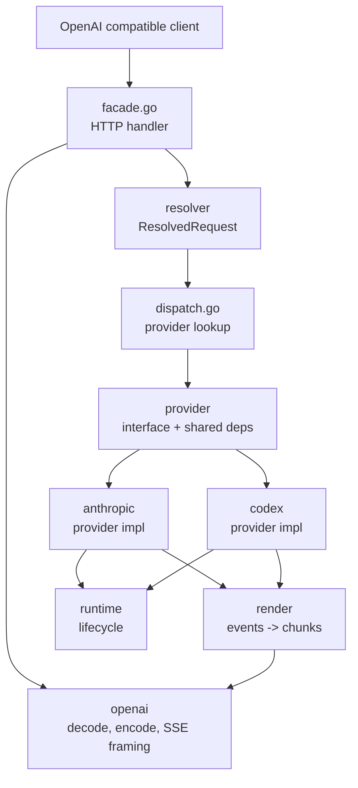

# Adapter refactor: execution plan

Source of truth for the OpenAI-compatible adapter refactor. Closed work lives in
`adapter-refactor-history.md`. Protocol and product evidence lives in
`adapter-refactor-research.md`. This file is a checklist, not a log. When work
lands, move it into the history file rather than crossing it out here.

## Goal

`internal/adapter/` exposes an OpenAI Chat Completions compatible HTTP surface
that routes to a typed `Provider` for each upstream model family. Each provider
owns its full vertical: request shaping, transport, response parsing. The
adapter owns request decode, model resolution, dispatch, and OpenAI response
encoding. Shared packages handle wire types, SSE framing, normalized events,
and lifecycle logging. There is no subprocess or app-mediated fallback.
There is no client-identity package.

## Definition of done

1. A new upstream provider can be added in one new directory under
   `internal/adapter/` plus a one-line registration in the dispatcher. No edits
   to existing providers, no edits to the root facade.
2. Anthropic changes do not touch Codex files. Codex changes do not touch
   Anthropic files.
3. Wire framing for OpenAI SSE lives in exactly one package.
4. The type hygiene rules below hold across every package under
   `internal/adapter/`.
5. All adapter request paths emit a normalized event stream that the render
   layer turns into OpenAI chunks. No backend-specific render branches.
6. Live traffic against the Anthropic OAuth bucket and a real Cursor session
   produces the expected logs (rate-limit classification, continuation reuse,
   turn metadata) with no manual reproduction harness.

## Type hygiene (binding)

These rules are binding for every package under `internal/adapter/` and for
every file the resolver, providers, render, runtime, openai, and dispatch
pipeline touch. They mirror the strict type hygiene block in `AGENTS.md` and
apply with no exceptions in this refactor.

- **No open payloads.** `any`, `interface{}`, `map[string]any`, `[]any`, and
  any equivalent untyped container are banned in production code. The same
  ban applies to test fixtures that exercise production code paths; tests
  must assert the typed shape.
- **No empty markers.** `struct{}` as a stand-in for a protocol message,
  request param, response param, config section, or domain state is banned.
  Empty JSON objects (`{}`) likewise cannot represent meaningful payloads.
- **Deeply enumerated.** Every wire, config, RPC, logging, and domain
  payload type is fully enumerated with named structs, typed fields, typed
  slices, typed maps, and explicit enum-like string types where applicable.
- **Unions are explicit.** If upstream data is a union, model the variants
  explicitly. If only some variants are supported today, enumerate the
  supported variants and reject or ignore unsupported ones intentionally at
  the boundary with a named error.
- **Schemas come from research.** Wire types under `anthropic/` and
  `codex/` are derived from `research/anthropic/` and `research/codex/`,
  not invented locally. The codegen pass in Plan 3 is how this rule is
  enforced; until that lands, hand-rolled types must still mirror the
  research schemas exactly.
- **Opacity is isolated.** If a JSON field must remain partially opaque for
  a real external contract, isolate that opacity at the smallest possible
  edge with a named type and a comment that cites the source contract. Raw
  or dynamic values do not leak into business logic, normalized events,
  config, or logs.
- **Existing loose types are debt, not precedent.** When a touched file
  contains a loose surface, replace it with enumerated types in the same
  change. If the replacement is larger than the active task, leave a narrow
  follow-up note that names the specific surface; do not propagate the
  pattern.

## Empirical findings (2026-04-27)

A side trip added inbound request discovery logging to `handleChat` and
captured a real Cursor session through the Cloudflare tunnel. ~14
captures across foreground agent and Plan modes. The shape is stable.

**Wire format.** Cursor server sends OpenAI Responses API requests to
`/v1/chat/completions`. Inputs go in `input` (not `messages`).
`previous_response_id` is never present on inbound traffic. Cursor sends
the full conversation each turn (~500KB at steady state).

**Top-level keys observed (stable across all captures):**
`include, input, metadata, model, prompt_cache_retention, reasoning, store,
stream, stream_options, tools, user`. `unknown_keys` is always empty.

**Cursor extensions live entirely in `metadata`:**
`cursorConversationId` and `cursorRequestId`. Nothing else.

**Tools (Responses API shape, no `function` sub-object):**
- Function tools: flat `{type, name, description, parameters, strict}`
- Custom tools: flat `{type, name, description, format}` where
  `format = {definition, syntax, type}`
- `ApplyPatch` is the only `custom` tool observed
- MCP tools come through as named function tools (`CallMcpTool`,
  `FetchMcpResource`)

**Mode flows as available tool set, not as request fields.** The
decompiled IDE-to-server proto carried `unified_mode`, `is_agentic`,
`is_background_composer`, `subagent_info`, `is_resume`. None reach our
adapter. Cursor server collapses them.
- Agent mode: 18 tools
- Plan mode: same set plus `CreatePlan`, total 19 tools
- Cursor product tools observed: `Subagent`, `SwitchMode`, `AskQuestion`,
  `CreatePlan`, `ApplyPatch`

**Continuation ledger reality check (superseded).** The original
`previous_response_id` reuse ledger fired but hit rate was bad: 1 of 6
turns on a real session, with 5 bailing to full replay. A 2026-04-27
MITM investigation against `codex` CLI and Codex.app established the
fingerprint-baseline approach was structurally wrong. Cross-process
`previous_response_id` reuse with `store: false` is not supported by
the upstream. The replacement approach is a persistent ws session
cache with intra-connection `previous_response_id` chaining and a
suffix-extension delta-input matcher. See Plan step 5 and CLYDE-126.

**Unresolved.** No `system` role observed on input items. The system
prompt path is unknown. Likely a `developer`-role item flushed before the
first capture or a prefix that survives prompt-cache. Image content types
also unobserved due to a known Cursor BYOK image upload bug.

## Target architecture

```
internal/adapter/
  facade.go                 // HTTP handler. Decode -> cursor.TranslateRequest -> resolve -> dispatch -> encode.
  dispatch.go               // Provider lookup by ResolvedRequest.Provider.
  openai/                   // OpenAI wire types, decode, encode, SSE framing.
  cursor/                   // Cursor product layer. openai.ChatRequest -> cursor.Request.
  resolver/                 // Model identity. cursor.Request -> ResolvedRequest.
  provider/                 // Provider interface and shared dependencies.
  anthropic/                // Provider impl. Direct Anthropic OAuth bucket.
  codex/                    // Provider impl. Direct websocket only.
  render/                   // Normalized events -> OpenAI chunks.
  runtime/                  // Backend-neutral lifecycle and notice logging.
```

`cursor/` stays as a named system. Cursor is the only client. The product
layer's job is small: parse `metadata.cursorConversationId` and
`cursorRequestId`, classify the available tool set (presence of
`Subagent`, `SwitchMode`, `AskQuestion`, `CreatePlan`, `ApplyPatch`,
`CallMcpTool`, `FetchMcpResource`), and pass a typed Request downstream.
There is no `RequestPathKind` enum. Mode is implied by which tools are
available. There is no separate MCP extraction step. MCP is two named
function tools.

Provider interface (sketch, exact shape lives in `provider/`):

```go
type Provider interface {
    Name() string
    BuildRequest(ctx context.Context, r ResolvedRequest) (ProviderRequest, error)
    Execute(ctx context.Context, req ProviderRequest, w EventWriter) error
}
```

Providers are constructed once at daemon startup with their dependencies
(config, auth, transport clients, logger). The dispatcher does not pass auth
or config through every call. There are no `*_bridge.go` files at the root.

`ResolvedRequest` is fully typed. It carries provider, family, effort,
context budget. The `cursor.Request` it was derived from rides alongside
so providers can read product hints (tool presence, conversation key)
without re-parsing.

Wire types under `anthropic/` and `codex/` are codegen targets. Source of truth
is `research/anthropic/` and `research/codex/`. Hand-rolled struct cleanup is
not a long-running task; it is replaced by a generator pass.

## Live package ownership

| Package | Ownership |
|---|---|
| `internal/adapter/` | HTTP handler and dispatch. No upstream wire knowledge. |
| `internal/adapter/openai/` | OpenAI request decode, response encode, SSE framing, wire types. |
| `internal/adapter/cursor/` | Cursor product layer. Translates `openai.ChatRequest` into `cursor.Request` (conversation key, request id, tool-presence flags, MCP tool name list). |
| `internal/adapter/resolver/` | Model identity. Takes `cursor.Request` and registry, returns `ResolvedRequest` (provider, family, effort, budget). |
| `internal/adapter/provider/` | Provider interface, shared event writer, shared error types. |
| `internal/adapter/anthropic/` | Anthropic OAuth direct provider. Request, transport, response. |
| `internal/adapter/codex/` | Codex websocket-only provider. Transport, continuation ledger, turn metadata. |
| `internal/adapter/render/` | Normalized event model. OpenAI chunk rendering. |
| `internal/adapter/runtime/` | Lifecycle logging, notice surfacing, request-scoped fields. |

## What gets deleted

These are removed as part of the refactor. Do not add new code under them.

- `internal/adapter/anthropic/fallback/` (entire package, including the
  `claude -p` subprocess driver, fallback request construction, fallback
  response mapping, transcript-resume mechanics, fallback stream conversion).
- `internal/adapter/codex_app_fallback.go`.
- `internal/adapter/anthropic_bridge.go` and `codex_bridge.go`.
- `internal/adapter/codex_runtime.go` and `codex_sessions.go`.
- `internal/adapter/oauth_handler.go` (most of it; auth lookup moves into
  provider construction).
- `internal/adapter/server_response.go` and `server_streaming.go` (merge and
  framing helpers; framing moves into `openai/`, merge dies with the bridges).
- `internal/adapter/tooltrans/` (the residual sentinel cleanup helpers move
  into the provider that needs them, or get inlined).
- `internal/adapter/finishreason/` may dissolve into the providers. Each
  provider already owns its own finish-reason mapping logic.

## Work plan

The plan is a stack of changes, ordered by dependency. Each item is sized to
land as a single PR. Mark `[x]` only when the change is in main. Add a dated
bullet to `adapter-refactor-history.md` at the same time.

### 1. Resolver and simplified cursor.Request (DONE)

`cursor/` stays. Empirical evidence (see findings) shows the cursor product
layer's job is small and concrete. The resolver consumes a typed
`cursor.Request` and returns a `ResolvedRequest` with model identity.

- [x] `internal/adapter/cursor/Request` carries typed `openai.ChatRequest`
  plus `ConversationID`, `RequestID`, tool-presence flags
  (`HasSubagentTool`, `HasSwitchModeTool`, `HasAskQuestionTool`,
  `HasCreatePlanTool`, `HasApplyPatchTool`), `MCPToolNames`. No
  `RequestPathKind` enum, no separate MCP extraction.
- [x] `internal/adapter/resolver/` exists with typed `ResolvedRequest`
  (provider, family, effort, context budget) and
  `Resolve(req cursor.Request, registry ModelRegistry) (ResolvedRequest, error)`.
- [x] Resolver bridges to `model.Registry` via `ModelRegistryAdapter`.
  Daemon-side `cursor.NormalizeModelAlias` callers route through it.
- [x] Tests cover model identity, conversation key derivation, tool
  presence classification.

### 2. Provider interface (DONE for Codex)

- [x] `internal/adapter/provider/` defines `Provider`, `ProviderRequest`,
  `EventWriter`, `Result`, `Registry`, typed errors. No upstream wire
  types leak in.
- [x] Daemon startup constructs `codex.Provider` with deps (
  `internal/adapter/server.go`). The provider is registered on
  `provider.Registry`. Dispatcher routes Codex traffic via the registry.
- [ ] Anthropic still goes through `anthropic_bridge.go` instead of
  `Provider.Execute`. This closes when Plan 4 lands.

### 3. Codegen wire types

- [ ] Add a `make wire-types` target. Source schemas live under
  `research/anthropic/` and `research/codex/`. Output goes into the provider
  packages. Codegen runs in CI and is checked in.
- [ ] Replace hand-rolled types in `internal/adapter/codex/request_builder.go`,
  `native_tools.go`, `events.go`, `continuation.go`, and the raw item-union
  helpers in `protocol.go` with the generated types. Remove all
  `map[string]any` payload probing in the same change.
- [ ] Same pass for Anthropic backend types where they still hand-roll.

### 4. Anthropic provider implementation

**Gate (P0). Byte-identical claude-cli wire parity.** Plan 4 cannot start
its rewrite until the claude-cli snapshot pipeline lands. The new provider
must reproduce claude-cli's outbound `/v1/messages` POST exactly: URL,
method, headers, beta list, build identifier, stainless package version,
system prompt prefix, request body framing. Drift in any of these causes
silent quality degradation in the OAuth bucket. We will not ship the
Anthropic provider half-assed.

Required preconditions (all land before any other Plan 4 work):

- [x] **MITM harness.** `clyde mitm capture --upstream claude-code` and the
  always-on TOML path both land claude-cli outbound under
  `~/.local/state/clyde/mitm/always-on/capture.jsonl`. Response bodies
  are decompressed in the capture path so JSON is readable for diffing.
- [x] **Snapshot v2 extractor.** `clyde mitm snapshot --v2` classifies
  records into per-flavor shapes with header presence/occurrence and
  body field tracking. The flavor classifier handles raw-mode JSON
  string bodies as well as summary-mode `{keys: [...]}` shapes.
- [x] **Source-of-truth generation.** `clyde mitm codegen --package
  anthropic` emits `internal/adapter/anthropic/wire_flavors_gen.go`
  from the v2 reference. Two parity tests
  (`TestOutboundHeadersMatchClaudeCLIInteractiveFlavor`,
  `TestOutboundHeadersAllowConfigOverride`) gate divergence at unit
  test time.
- [x] **Body-side identity parity.** Adapter emits `metadata.user_id`
  (with stable `device_id`, OAuth-derived `account_uuid`, and
  per-conversation `session_id`) and
  `context_management.clear_thinking_20251015` whenever thinking is
  on, matching the captured reference exactly.
- [x] **Live byte-identical verification.** Cursor turns against Opus
  through the daemon route via MITM landed at
  `~/.local/state/clyde/mitm/always-on/capture.jsonl`.
  `clyde mitm snapshot --v2` extracted a single
  `claude-code-interactive-6fde33e0` flavor matching the canonical
  reference. `clyde mitm diff` returned `snapshot parity: clean`.
- [x] **Drift alarm.** `clyde mitm drift-check` lands per-upstream
  JSONL outcomes at `~/.local/state/clyde/mitm-drift/<upstream>.jsonl`.
  The daemon scheduler runs it on a configurable interval via
  `[mitm.drift]` config.

Provider work itself:

- [ ] `internal/adapter/anthropic/` implements `Provider` directly
  against the OAuth bucket. No subprocess. No `claude -p`. No
  fallback escalation logic.
- [ ] Classifier (`ResponseClass`, header interpretation, native error
  envelopes) stays. Live-validate against real 429s. Attach captured
  logs to the history file.
- [ ] Delete `internal/adapter/anthropic/fallback/`.
- [ ] Delete root finish-reason callers (`internal/adapter/stream.go:150`
  and any leftover after the fallback package is gone). Provider owns
  its own finish-reason mapping.
- [ ] Live validation: a real Cursor + Anthropic-OAuth turn produces
  zero divergence against the canonical reference. The diff tool gates
  the slice. Manual eyeballing is not enough.

### 5. Codex provider implementation (parity superset of CLI + Desktop)

The Codex provider implements a strict superset of the wire behaviors observed
across `codex` CLI (interactive), `codex exec` non-interactive, and Codex
Desktop. Reference captures live in
`research/codex/captures/2026-04-27/`. Implementation tracked in
**CLYDE-126**. Drift detection harness is **CLYDE-125**.

Transport. Direct websocket via gorilla/websocket (`transport_ws.go`)
hitting `wss://chatgpt.com/backend-api/codex/responses` with the OAuth
access token from `~/.codex/auth.json`. No HTTPS+SSE transport. No
`codex app-server` subprocess. Both deleted on 2026-04-27.

Empirical timings. The websocket path is ~5x faster per turn than the
subprocess (median ~860ms vs ~5300ms for a trivial completion against
`gpt-5.3-codex`).

Connection lifecycle (NEW, CLYDE-126).

- The provider maintains a per-conversation `WebsocketSessionCache`
  keyed on `cursorConversationId`. Each entry holds the live
  `*websocket.Conn`, the last `resp_*` id from this connection, the
  prior input baseline for delta computation, and an idle timestamp.
- The current `RunWebsocketTransport` dials a fresh ws per request and
  defers Close, which throws away the only mechanism the upstream
  offers for cross-turn cost reduction. Reuse the connection.
- Within a cached session, chain `previous_response_id` across every
  `response.create` frame. `store: false` does not block this; the
  constraint is same-connection lifetime.
- Two-frame protocol unconditional: warmup `generate: false` (no input,
  no prev) returns a `resp_*`; first real frame sets
  `previous_response_id = warmup_resp` with delta input. Subsequent
  frames chain off the prior `resp_*`.
- Invalidate on any ws read or write error, server `response.failed`,
  baseline divergence, idle timeout (default 10 minutes), or daemon
  shutdown.

Identity headers (NEW, CLYDE-126).

- `originator: clyde` (own first-party identity, not spoofed
  `codex_exec` or `Codex Desktop`).
- `x-codex-turn-metadata` JSON with `session_id`, `thread_source`,
  `turn_id`, `sandbox`, and a `workspaces` block populated from the
  Cursor request when available. Mirror in `client_metadata`.
- `x-codex-installation-id` from `~/.codex/installation_id` if present;
  otherwise generate-and-persist a clyde-owned uuid at
  `~/.config/clyde/codex-installation-id`. Mirror in `client_metadata`.
- `x-codex-window-id` stays `<conv>:0` always. Confirmed empirical.
- `prompt_cache_key = <cursorConversationId>`. Already correct.

Status of deletions (DONE 2026-04-27).

- [x] `internal/adapter/codex/` implements `Provider` against the direct
  websocket transport only.
- [x] Deleted `internal/adapter/codex/rpc_client.go` (subprocess entry).
- [x] Deleted `internal/adapter/codex/transport_app.go` and
  `internal/adapter/codex/app_protocol.go` (stdio JSON-RPC transport).
- [x] Deleted `internal/adapter/codex_app_fallback.go` and the
  dispatcher glue.
- [x] Deleted `internal/adapter/codex/transport_http.go` and the SSE
  parsing helpers that no longer have a caller.
- [x] Dropped `Codex.AppServerPath`, `Codex.AppFallback`,
  `Codex.AppFallbackTimeout`, `Codex.WebsocketEnabled`.

Outstanding (CLYDE-126). All done as of 2026-04-28.

- [x] `internal/adapter/codex/installation.go` reads
  `~/.codex/installation_id` or generates a persisted clyde uuid.
- [x] `internal/adapter/codex/turn_metadata.go` carries typed
  `TurnMetadata` with a `Workspaces` block. JSON marshal helper present.
- [x] `originator` (defaults to `clyde`) plus
  `x-codex-turn-metadata` set in `ws_headers.go`. Mirrored in
  `request_builder.go` `client_metadata`.
- [x] `internal/adapter/codex/ws_session.go` provides
  `WebsocketSession`, `WebsocketSessionCache`, Take/Put/Invalidate/CloseAll.
- [x] `internal/adapter/codex/delta_input.go` provides `ComputeDelta`
  for suffix-extension comparison. Replaces the cross-process
  fingerprint-baseline matcher.
- [x] `RunWebsocketTransport` takes a session from the cache, dials
  fresh on miss with warmup, chains `previous_response_id`, puts the
  session back on success, invalidates on error.
- [x] `NewProvider` constructs the cache once. The `ContinuationStore`
  was removed from `direct_runtime.go` and `server.go`.
- [x] `Server.Shutdown` calls `s.codexProvider.CloseAllSessions("shutdown")`.
- [x] `WebsocketSessionCache` uses an idle TTL with
  `idle_timeout` invalidation. Default and config knob can move into
  `internal/config/config.go` if a user reports a value mismatch.
- [x] `ContinuationTelemetry` log fields replaced by
  `adapter.codex.ws_session.{opened,taken,put,invalidated}` and
  `adapter.codex.frame.sent`.

### 5b. Cross-process fingerprint matcher (superseded)

A 2026-04-27 MITM investigation established that cross-process and
cross-connection `previous_response_id` reuse with `store: false` is
structurally not supported by the upstream. The 1/6 hit rate observed
from the existing fingerprint matcher is misleading; even the 1 "hit"
would have failed at the upstream had the prior connection actually
closed. The fingerprint approach was solving the wrong problem. CLYDE-126
replaces it with the persistent ws session cache plus delta-input
suffix-extension matcher described in step 5 above. CLYDE-123
(continuation hit rate) closes as superseded.

### 6. Render layer is the only OpenAI framing owner

- [ ] Anthropic and Codex parsers emit normalized events directly via
  `EventWriter`. Remove any backend-specific render branches.
- [ ] All OpenAI SSE framing lives in `openai/`. `render/` consumes events,
  `openai/` writes the wire format.
- [ ] Tests at this layer: backend tests assert event production. Render
  tests assert OpenAI chunks.

### 7. Delete the root cruft

After items 1 through 6 land, the bridges become unused.

- [ ] Delete `internal/adapter/anthropic_bridge.go`. Closes with Plan 4.
- [x] Deleted `internal/adapter/codex_bridge.go`. The shared methods
  it exposed (EmitRequestStarted, LogTerminal, etc.) moved into
  `anthropic_bridge.go` because the Anthropic backend Dispatcher
  interface is the only consumer that still requires them. Codex
  provider dispatch calls private equivalents directly.
- [x] Deleted `internal/adapter/codex_runtime.go`. The codex package
  now ships sensible production defaults (os.Getwd, $SHELL detection)
  so the daemon does not need an init-only override file.
- [x] Deleted `internal/adapter/codex_sessions.go`.
- [ ] Reduce `internal/adapter/oauth_handler.go` to nothing or move the few
  remaining helpers into provider construction at startup.
- [ ] Delete `internal/adapter/server_response.go` merge helpers.
- [ ] Reduce `internal/adapter/server_streaming.go` to backend-neutral helpers
  only, then evaluate whether anything is left.
- [ ] Delete `internal/adapter/tooltrans/`. Inline the sentinel helpers where
  they are used.
- [ ] Sweep unused imports and dead types.

### 8. Test layout

- [ ] Tests under provider packages, not the root.
- [ ] Render and runtime tests under their own packages.
- [ ] Root tests cover only HTTP routing, auth lookup, dispatch, and request
  logging.
- [ ] Per-provider lock-in tests: one test that fails if the provider's
  ownership boundary regresses.
- [ ] Remove duplicated coverage between root and provider packages.

### 9. Live validation

The refactor is not done until live traffic confirms it.

- [ ] Anthropic rate-limit classifier validated against real 429s.
- [ ] Codex `previous_response_id` chaining validated within a single
  cached ws connection across 3+ Cursor turns on the same conversation.
- [ ] Codex turn metadata (`x-codex-turn-metadata` workspaces block,
  `originator: clyde`, `x-codex-installation-id`) validated against a
  live ChatGPT Pro session. Compare against
  `research/codex/captures/2026-04-27/` reference.
- [ ] ws connection reuse rate above 90% per conversation on a fresh
  5+ turn Cursor agent session, measured from
  `adapter.codex.ws_session.{opened,taken}` logs.
- [ ] Delta-input rate above 80% on turns after the first, measured as
  `delta_input_count / total_response_create_count` from
  `adapter.codex.frame.sent` logs.
- [ ] Token usage on turn 2 prompt_tokens drops to roughly delta plus
  cached prefix, not a full replay. Pre-refactor baseline is full
  replay every turn (~500 KB inbound times N turns).
- [ ] Capture logs from `~/.local/state/clyde/clyde-daemon.jsonl` and
  `~/.local/state/clyde/anthropic.jsonl`. Attach excerpts to the
  history file under `research/cursor/captures/<timestamp>/`.

## Conventions

- GitHub-style checkboxes. `- [ ]` for open. `- [x]` for done. When marking
  done, append a dated bullet to `adapter-refactor-history.md`.
- Code citations use `path:line` format. Update on drift.
- Strict type hygiene per `AGENTS.md`. No `any`, no `interface{}`, no
  `map[string]any` in production code.
- Structured logging per `AGENTS.md`. Each provider boundary emits
  `provider.<name>.request.started` and `.completed` events.

## References

- History log: [`adapter-refactor-history.md`](./adapter-refactor-history.md)
- Research and evidence: [`adapter-refactor-research.md`](./adapter-refactor-research.md)
- Audit: [`adapter-refactor-audit.md`](./adapter-refactor-audit.md)
- Live adapter logs: `~/.local/state/clyde/clyde-daemon.jsonl`
- Live Anthropic logs: `~/.local/state/clyde/anthropic.jsonl`
- Local research tree: `/Users/agoodkind/Sites/clyde-dev/clyde/research`

## Architecture diagram


