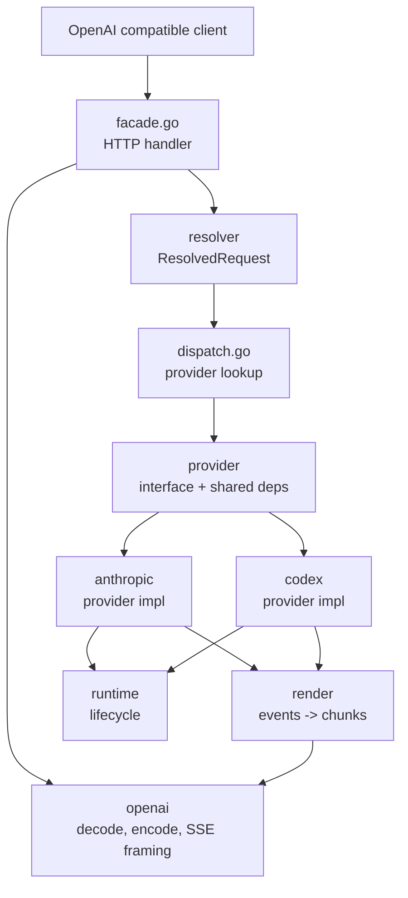

# Adapter refactor: execution plan

Source of truth for the OpenAI-compatible adapter refactor. Closed work lives in
`adapter-refactor-history.md`. Protocol and product evidence lives in
`adapter-refactor-research.md`. This file is a checklist, not a log. When work
lands, move it into the history file rather than crossing it out here.

## Goal

`internal/adapter/` exposes an OpenAI Chat Completions compatible HTTP surface
that routes to a typed `Provider` for each upstream model family. Each provider
owns its full vertical: request shaping, transport, response parsing. The
adapter owns request decode, model resolution, dispatch, and OpenAI response
encoding. Shared packages handle wire types, SSE framing, normalized events,
and lifecycle logging. There is no subprocess or app-mediated fallback.
There is no client-identity package.

## Definition of done

1. A new upstream provider can be added in one new directory under
   `internal/adapter/` plus a one-line registration in the dispatcher. No edits
   to existing providers, no edits to the root facade.
2. Anthropic changes do not touch Codex files. Codex changes do not touch
   Anthropic files.
3. Wire framing for OpenAI SSE lives in exactly one package.
4. The type hygiene rules below hold across every package under
   `internal/adapter/`.
5. All adapter request paths emit a normalized event stream that the render
   layer turns into OpenAI chunks. No backend-specific render branches.
6. Live traffic against the Anthropic OAuth bucket and a real Cursor session
   produces the expected logs (rate-limit classification, continuation reuse,
   turn metadata) with no manual reproduction harness.

## Type hygiene (binding)

These rules are binding for every package under `internal/adapter/` and for
every file the resolver, providers, render, runtime, openai, and dispatch
pipeline touch. They mirror the strict type hygiene block in `AGENTS.md` and
apply with no exceptions in this refactor.

- **No open payloads.** `any`, `interface{}`, `map[string]any`, `[]any`, and
  any equivalent untyped container are banned in production code. The same
  ban applies to test fixtures that exercise production code paths; tests
  must assert the typed shape.
- **No empty markers.** `struct{}` as a stand-in for a protocol message,
  request param, response param, config section, or domain state is banned.
  Empty JSON objects (`{}`) likewise cannot represent meaningful payloads.
- **Deeply enumerated.** Every wire, config, RPC, logging, and domain
  payload type is fully enumerated with named structs, typed fields, typed
  slices, typed maps, and explicit enum-like string types where applicable.
- **Unions are explicit.** If upstream data is a union, model the variants
  explicitly. If only some variants are supported today, enumerate the
  supported variants and reject or ignore unsupported ones intentionally at
  the boundary with a named error.
- **Schemas come from research.** Wire types under `anthropic/` and
  `codex/` are derived from `research/anthropic/` and `research/codex/`,
  not invented locally. The codegen pass in Plan 3 is how this rule is
  enforced; until that lands, hand-rolled types must still mirror the
  research schemas exactly.
- **Opacity is isolated.** If a JSON field must remain partially opaque for
  a real external contract, isolate that opacity at the smallest possible
  edge with a named type and a comment that cites the source contract. Raw
  or dynamic values do not leak into business logic, normalized events,
  config, or logs.
- **Existing loose types are debt, not precedent.** When a touched file
  contains a loose surface, replace it with enumerated types in the same
  change. If the replacement is larger than the active task, leave a narrow
  follow-up note that names the specific surface; do not propagate the
  pattern.

## Empirical findings (2026-04-27)

A side trip added inbound request discovery logging to `handleChat` and
captured a real Cursor session through the Cloudflare tunnel. ~14
captures across foreground agent and Plan modes. The shape is stable.

**Wire format.** Cursor server sends OpenAI Responses API requests to
`/v1/chat/completions`. Inputs go in `input` (not `messages`).
`previous_response_id` is never present on inbound traffic. Cursor sends
the full conversation each turn (~500KB at steady state).

**Top-level keys observed (stable across all captures):**
`include, input, metadata, model, prompt_cache_retention, reasoning, store,
stream, stream_options, tools, user`. `unknown_keys` is always empty.

**Cursor extensions live entirely in `metadata`:**
`cursorConversationId` and `cursorRequestId`. Nothing else.

**Tools (Responses API shape, no `function` sub-object):**
- Function tools: flat `{type, name, description, parameters, strict}`
- Custom tools: flat `{type, name, description, format}` where
  `format = {definition, syntax, type}`
- `ApplyPatch` is the only `custom` tool observed
- MCP tools come through as named function tools (`CallMcpTool`,
  `FetchMcpResource`)

**Mode flows as available tool set, not as request fields.** The
decompiled IDE-to-server proto carried `unified_mode`, `is_agentic`,
`is_background_composer`, `subagent_info`, `is_resume`. None reach our
adapter. Cursor server collapses them.
- Agent mode: 18 tools
- Plan mode: same set plus `CreatePlan`, total 19 tools
- Cursor product tools observed: `Subagent`, `SwitchMode`, `AskQuestion`,
  `CreatePlan`, `ApplyPatch`

**Continuation ledger reality check.** The `previous_response_id` reuse
ledger fires but hit rate is bad. 1 of 6 turns hit on a real session.
Five of six bailed to full replay with `miss_reason:
output_item_baseline_mismatch`. This is its own P1 work item; see Plan
step "Continuation hit rate fix".

**Unresolved.** No `system` role observed on input items. The system
prompt path is unknown. Likely a `developer`-role item flushed before the
first capture or a prefix that survives prompt-cache. Image content types
also unobserved due to a known Cursor BYOK image upload bug.

## Target architecture

```
internal/adapter/
  facade.go                 // HTTP handler. Decode -> cursor.TranslateRequest -> resolve -> dispatch -> encode.
  dispatch.go               // Provider lookup by ResolvedRequest.Provider.
  openai/                   // OpenAI wire types, decode, encode, SSE framing.
  cursor/                   // Cursor product layer. openai.ChatRequest -> cursor.Request.
  resolver/                 // Model identity. cursor.Request -> ResolvedRequest.
  provider/                 // Provider interface and shared dependencies.
  anthropic/                // Provider impl. Direct Anthropic OAuth bucket.
  codex/                    // Provider impl. Direct websocket only.
  render/                   // Normalized events -> OpenAI chunks.
  runtime/                  // Backend-neutral lifecycle and notice logging.
```

`cursor/` stays as a named system. Cursor is the only client. The product
layer's job is small: parse `metadata.cursorConversationId` and
`cursorRequestId`, classify the available tool set (presence of
`Subagent`, `SwitchMode`, `AskQuestion`, `CreatePlan`, `ApplyPatch`,
`CallMcpTool`, `FetchMcpResource`), and pass a typed Request downstream.
There is no `RequestPathKind` enum. Mode is implied by which tools are
available. There is no separate MCP extraction step. MCP is two named
function tools.

Provider interface (sketch, exact shape lives in `provider/`):

```go
type Provider interface {
    Name() string
    BuildRequest(ctx context.Context, r ResolvedRequest) (ProviderRequest, error)
    Execute(ctx context.Context, req ProviderRequest, w EventWriter) error
}
```

Providers are constructed once at daemon startup with their dependencies
(config, auth, transport clients, logger). The dispatcher does not pass auth
or config through every call. There are no `*_bridge.go` files at the root.

`ResolvedRequest` is fully typed. It carries provider, family, effort,
context budget. The `cursor.Request` it was derived from rides alongside
so providers can read product hints (tool presence, conversation key)
without re-parsing.

Wire types under `anthropic/` and `codex/` are codegen targets. Source of truth
is `research/anthropic/` and `research/codex/`. Hand-rolled struct cleanup is
not a long-running task; it is replaced by a generator pass.

## Live package ownership

| Package | Ownership |
|---|---|
| `internal/adapter/` | HTTP handler and dispatch. No upstream wire knowledge. |
| `internal/adapter/openai/` | OpenAI request decode, response encode, SSE framing, wire types. |
| `internal/adapter/cursor/` | Cursor product layer. Translates `openai.ChatRequest` into `cursor.Request` (conversation key, request id, tool-presence flags, MCP tool name list). |
| `internal/adapter/resolver/` | Model identity. Takes `cursor.Request` and registry, returns `ResolvedRequest` (provider, family, effort, budget). |
| `internal/adapter/provider/` | Provider interface, shared event writer, shared error types. |
| `internal/adapter/anthropic/` | Anthropic OAuth direct provider. Request, transport, response. |
| `internal/adapter/codex/` | Codex websocket-only provider. Transport, continuation ledger, turn metadata. |
| `internal/adapter/render/` | Normalized event model. OpenAI chunk rendering. |
| `internal/adapter/runtime/` | Lifecycle logging, notice surfacing, request-scoped fields. |

## What gets deleted

These are removed as part of the refactor. Do not add new code under them.

- `internal/adapter/anthropic/fallback/` (entire package, including the
  `claude -p` subprocess driver, fallback request construction, fallback
  response mapping, transcript-resume mechanics, fallback stream conversion).
- `internal/adapter/codex_app_fallback.go`.
- `internal/adapter/anthropic_bridge.go` and `codex_bridge.go`.
- `internal/adapter/codex_runtime.go` and `codex_sessions.go`.
- `internal/adapter/oauth_handler.go` (most of it; auth lookup moves into
  provider construction).
- `internal/adapter/server_response.go` and `server_streaming.go` (merge and
  framing helpers; framing moves into `openai/`, merge dies with the bridges).
- `internal/adapter/tooltrans/` (the residual sentinel cleanup helpers move
  into the provider that needs them, or get inlined).
- `internal/adapter/finishreason/` may dissolve into the providers. Each
  provider already owns its own finish-reason mapping logic.

## Work plan

The plan is a stack of changes, ordered by dependency. Each item is sized to
land as a single PR. Mark `[x]` only when the change is in main. Add a dated
bullet to `adapter-refactor-history.md` at the same time.

### 1. Resolver and simplified cursor.Request

`cursor/` stays. Empirical evidence (see findings) shows the cursor product
layer's job is small and concrete. The resolver consumes a typed
`cursor.Request` and returns a `ResolvedRequest` with model identity.

- [ ] Trim `internal/adapter/cursor/` to the empirically-grounded shape:
  `cursor.Request` carries the typed `openai.ChatRequest` plus
  `ConversationID` (from `metadata.cursorConversationId`),
  `RequestID` (from `metadata.cursorRequestId`), tool-presence flags
  (`HasSubagentTool`, `HasSwitchModeTool`, `HasAskQuestionTool`,
  `HasCreatePlanTool`, `HasApplyPatchTool`), and an `MCPToolNames` slice
  derived from `CallMcpTool`/`FetchMcpResource`/MCP-prefixed function
  tool names. No `RequestPathKind` enum. No separate MCP extraction
  pipeline.
- [ ] Build `internal/adapter/resolver/`. Define `ResolvedRequest` carrying
  provider, family, effort, context budget. Implement
  `Resolve(req cursor.Request, registry ModelRegistry) (ResolvedRequest, error)`.
  No `any`.
- [ ] Replace every `cursor.NormalizeModelAlias` call site
  (`internal/daemon/server.go` lines 580, 613, 718, 731, 806, 936, 942,
  952, 960, 1239, 1303, 1397, 1417; `internal/compact/runtime.go:38`;
  `internal/adapter/cursor/request.go:38`) with a call into
  `resolver.Resolve`.
- [ ] Tests cover model identity, conversation key derivation, and tool
  presence classification.

### 2. Provider interface

- [ ] Define `Provider`, `ProviderRequest`, `EventWriter` in `provider/`. No
  upstream wire types in this package. `EventWriter` accepts normalized events
  from `render/`.
- [ ] Daemon startup constructs each provider with its dependencies. The
  dispatcher takes a `ResolvedRequest`, looks up the provider by
  `ResolvedRequest.Provider`, calls `Execute`. No bridges, no per-call
  dependency threading.

### 3. Codegen wire types

- [ ] Add a `make wire-types` target. Source schemas live under
  `research/anthropic/` and `research/codex/`. Output goes into the provider
  packages. Codegen runs in CI and is checked in.
- [ ] Replace hand-rolled types in `internal/adapter/codex/request_builder.go`,
  `native_tools.go`, `events.go`, `continuation.go`, and the raw item-union
  helpers in `protocol.go` with the generated types. Remove all
  `map[string]any` payload probing in the same change.
- [ ] Same pass for Anthropic backend types where they still hand-roll.

### 4. Anthropic provider implementation

**Gate (P0). Byte-identical claude-cli wire parity.** Plan 4 cannot start
its rewrite until the claude-cli snapshot pipeline lands. The new provider
must reproduce claude-cli's outbound `/v1/messages` POST exactly: URL,
method, headers, beta list, build identifier, stainless package version,
system prompt prefix, request body framing. Drift in any of these causes
silent quality degradation in the OAuth bucket. We will not ship the
Anthropic provider half-assed.

Required preconditions (all land before any other Plan 4 work):

- [ ] **MITM polling harness.** Capture a real `claude` CLI invocation
  through a local proxy and snapshot the full outbound POST to
  `research/anthropic/captures/<timestamp>/cli-call.json`. Wired up via
  `make capture-claude-cli` and a scheduled task that runs daily.
- [ ] **Snapshot diff tool.** Go utility that diffs the new provider's
  reconstructed wire request against the latest snapshot byte-for-byte.
  Fails CI on divergence. Runs locally for dev loops.
- [ ] **Source-of-truth generation.** Snapshot drives a generated
  constants file consumed by the new request_builder. The `[adapter.anthropic]`
  client_identity TOML keys move out of hand-curated defaults.
- [ ] **Drift alarm.** Scheduled poll surfaces a notification or ticket
  when the snapshot changes vs. the committed source of truth.

Once the gate is green, the provider work itself:

- [ ] `internal/adapter/anthropic/` implements `Provider` directly against
  the OAuth bucket. No subprocess, no `claude -p`, no fallback escalation
  logic.
- [ ] Classifier (`ResponseClass`, header interpretation, native error
  envelopes) stays. Live-validate against real 429s and attach captured
  logs to the history file.
- [ ] Delete `internal/adapter/anthropic/fallback/`.
- [ ] Delete root finish-reason callers (`internal/adapter/stream.go:150`
  and any leftover after the fallback package is gone). Provider owns its
  own finish-reason mapping.
- [ ] Live validation: a real Cursor + Anthropic-OAuth turn diffs against
  the captured claude-cli snapshot at zero divergence. The diff tool gates
  the slice; manual eyeballing is not enough.

### 5. Codex provider implementation

Codex has exactly one transport. Direct websocket via gorilla/websocket
(`transport_ws.go`) hitting `wss://chatgpt.com/backend-api/codex/responses`
with the OAuth access token from `~/.codex/auth.json`. No HTTPS+SSE
transport. No `codex app-server` subprocess.

Empirical justification. The websocket path is ~5x faster per turn than the
subprocess (median ~860ms vs ~5300ms for a trivial completion against
`gpt-5.3-codex`) and is the only path that exposes `previous_response_id`
reuse, midstream reconnect, and turn metadata. Cursor sessions are stateful
end to end, so reconnect and continuation are required. The HTTPS+SSE
transport offers slightly faster TTFT but no continuation, so it does not
serve the use case.

- [ ] `internal/adapter/codex/` implements `Provider` against the direct
  websocket transport only.
- [ ] Continuation ledger and `previous_response_id` reuse already shipped;
  verify under live Cursor reconnect and attach
  `adapter.codex.continuation.decided` logs to the history file.
- [ ] Delete `internal/adapter/codex/rpc_client.go`. This is the
  `exec.CommandContext` entry point that spawned
  `codex app-server --listen stdio://`.
- [ ] Delete `internal/adapter/codex/transport_app.go` and
  `internal/adapter/codex/app_protocol.go`. These are the stdio JSON-RPC
  transport and protocol types.
- [ ] Delete `internal/adapter/codex_app_fallback.go` and the dispatcher
  glue that wired the subprocess in.
- [ ] Delete `internal/adapter/codex/transport_http.go` and the SSE-only
  parsing helpers that no longer have a caller.
- [ ] Drop the related config: `Codex.AppServerPath`, `Codex.AppFallback`,
  `Codex.AppFallbackTimeout`, `Codex.WebsocketEnabled` (becomes always-on).
- [ ] Tool-use, cancellation, and failure characterization captured. Document
  expected normalized event shape per case in
  `adapter-refactor-research.md`.

### 5b. Continuation hit rate fix

Empirical capture from a real Cursor session shows the continuation ledger
fires but the baseline check rejects most reuse opportunities. 1 of 6 turns
hit. 5 of 6 bailed to full replay with `miss_reason:
output_item_baseline_mismatch`. Cursor sends ~500KB of conversation per
turn, so missed continuation is a direct cost-and-latency loss on every
turn. This is the single biggest measurable performance issue in the
adapter today and is independent of the architectural refactor.

- [ ] Expand `LogContinuationDecision` in
  `internal/adapter/codex/telemetry.go` to record which baseline field
  diverged on a miss. New fields: `mismatch_field`,
  `stored_fingerprint`, `incoming_fingerprint`,
  `mismatch_diff_summary`.
- [ ] Capture 20+ live agent-mode turns from a fresh Cursor session and
  classify the mismatch distribution by `mismatch_field`. Save to
  `research/cursor/captures/<timestamp>/continuation-hit-rate.md`.
- [ ] Identify which baseline fields are noise vs signal in
  `internal/adapter/codex/continuation.go`. Likely noise candidates to
  exclude from the fingerprint: `cursorRequestId` (per-turn unique by
  definition), turn-scoped ordering of `output_items` that are
  semantically equivalent, optional protocol fields that round-trip
  differently. Likely signal that must stay: tool-list identity, model
  identity, effort, conversation prefix.
- [ ] Tighten the baseline so equivalent turns hit. Acceptance: above 80%
  hit rate on a 5+ turn agent session that uses tools.
- [ ] Add a per-conversation rolling hit-rate metric to
  `adapter.codex.continuation.decided`. Surfaces a regression from logs
  alone.
- [ ] Add a regression test next to `continuation_test.go` that drives
  the ledger through three consecutive turns with a stable tool list and
  asserts turns 2 and 3 hit.
- [ ] Update `adapter-refactor-history.md` with before-and-after hit
  rates once the fix lands. Pre-refactor baseline is 1 of 6 = ~17% on
  2026-04-27.

This step blocks Plan step 9 live validation (Plan 9b in Tack). The
reconnect work cannot be declared done while baseline mismatch is the
dominant outcome.

### 6. Render layer is the only OpenAI framing owner

- [ ] Anthropic and Codex parsers emit normalized events directly via
  `EventWriter`. Remove any backend-specific render branches.
- [ ] All OpenAI SSE framing lives in `openai/`. `render/` consumes events,
  `openai/` writes the wire format.
- [ ] Tests at this layer: backend tests assert event production. Render
  tests assert OpenAI chunks.

### 7. Delete the root cruft

After items 1 through 6 land, the bridges become unused.

- [ ] Delete `internal/adapter/anthropic_bridge.go`.
- [ ] Delete `internal/adapter/codex_bridge.go`.
- [ ] Delete `internal/adapter/codex_runtime.go`.
- [ ] Delete `internal/adapter/codex_sessions.go`.
- [ ] Reduce `internal/adapter/oauth_handler.go` to nothing or move the few
  remaining helpers into provider construction at startup.
- [ ] Delete `internal/adapter/server_response.go` merge helpers.
- [ ] Reduce `internal/adapter/server_streaming.go` to backend-neutral helpers
  only, then evaluate whether anything is left.
- [ ] Delete `internal/adapter/tooltrans/`. Inline the sentinel helpers where
  they are used.
- [ ] Sweep unused imports and dead types.

### 8. Test layout

- [ ] Tests under provider packages, not the root.
- [ ] Render and runtime tests under their own packages.
- [ ] Root tests cover only HTTP routing, auth lookup, dispatch, and request
  logging.
- [ ] Per-provider lock-in tests: one test that fails if the provider's
  ownership boundary regresses.
- [ ] Remove duplicated coverage between root and provider packages.

### 9. Live validation

The refactor is not done until live traffic confirms it.

- [ ] Anthropic rate-limit classifier validated against real 429s.
- [ ] Codex `previous_response_id` reuse validated against a real Cursor
  reconnect.
- [ ] Codex turn metadata validated against a live ChatGPT Pro session.
- [ ] Continuation hit rate above 80% on a fresh 5+ turn Cursor agent
  session, measured from `adapter.codex.continuation.decided` logs.
  Pre-refactor baseline is 1 of 6 = ~17% (2026-04-27). This is the
  before/after gate for whether step 5b worked.
- [ ] Capture logs from `~/.local/state/clyde/clyde-daemon.jsonl` and
  `~/.local/state/clyde/anthropic.jsonl`. Attach excerpts to the history file.

## Conventions

- GitHub-style checkboxes. `- [ ]` for open. `- [x]` for done. When marking
  done, append a dated bullet to `adapter-refactor-history.md`.
- Code citations use `path:line` format. Update on drift.
- Strict type hygiene per `AGENTS.md`. No `any`, no `interface{}`, no
  `map[string]any` in production code.
- Structured logging per `AGENTS.md`. Each provider boundary emits
  `provider.<name>.request.started` and `.completed` events.

## References

- History log: [`adapter-refactor-history.md`](./adapter-refactor-history.md)
- Research and evidence: [`adapter-refactor-research.md`](./adapter-refactor-research.md)
- Audit: [`adapter-refactor-audit.md`](./adapter-refactor-audit.md)
- Live adapter logs: `~/.local/state/clyde/clyde-daemon.jsonl`
- Live Anthropic logs: `~/.local/state/clyde/anthropic.jsonl`
- Local research tree: `/Users/agoodkind/Sites/clyde-dev/clyde/research`

## Architecture diagram


