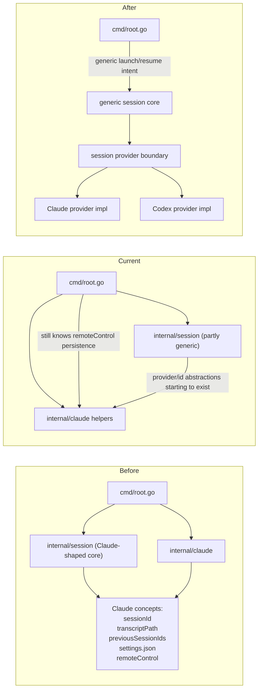
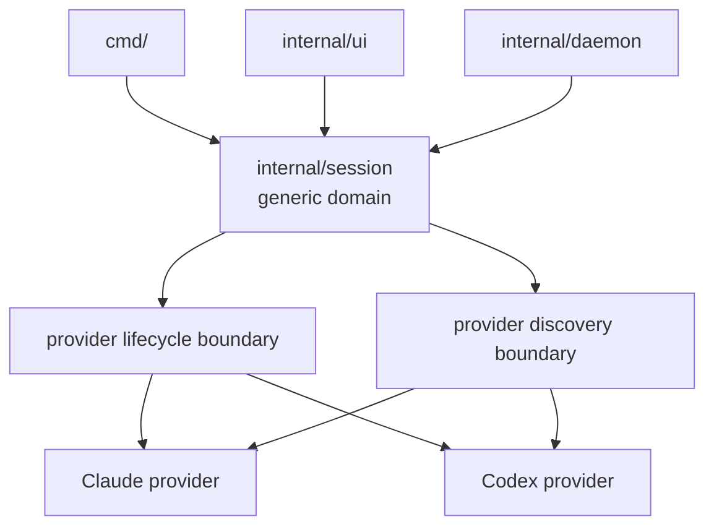

# Session Provider Refactor Master Plan

This document is the source of truth for the Clyde session-provider refactor.
Its job is to make the session stack provider-neutral first, then move Claude
behind that abstraction, then add Codex cleanly. It is intentionally broader
than the Codex MVP plan because the main risk is not Codex itself. The main risk
is keeping Claude semantics as the hidden default model and then bolting Codex
onto that shape.

This is a planning document, not an append-only history log. When a concrete
slice lands, summarize the result in a dated entry elsewhere and keep this file
focused on architecture, phases, and boundaries.

## Goal

`clyde` should own a generic session domain and a generic session lifecycle.
Providers should own provider-native identity, discovery, launch, resume,
cleanup, settings, and optional capabilities such as transcript history or
remote control. `cmd/`, `internal/ui/`, and `internal/daemon/` should talk to
that generic boundary rather than speaking Claude-specific concepts directly.

Definition of done:

1. `cmd/` launches and resumes sessions through a provider-neutral contract.
2. `internal/session/` models provider-neutral session state and provider-owned
   extensions without treating Claude as the default schema.
3. Claude is one provider implementation behind the abstraction, not the
   implicit core behavior.
4. Codex can be added as a second provider without widening Claude-shaped
   conditionals in `cmd/`, `internal/session/`, `internal/ui/`, or
   `internal/daemon/`.
5. Provider-specific capabilities such as transcript parsing, remote control,
   settings persistence, and identity rollover are explicit rather than
   ambient assumptions.

## Problem Statement

The repo currently mixes three layers that should be separate:

1. Clyde-owned session concepts:
   `name`, workspace association, context, parent linkage, list/search/rename
2. Provider-owned lifecycle concepts:
   session identity, launch/resume command shape, discovery, cleanup,
   provider-specific settings
3. Claude-specific implementation details:
   `sessionId`, `transcriptPath`, `previousSessionIds`, `settings.json`,
   SessionStart hook adoption, remote control persistence

The current risk is not just that some fields are named after Claude. The
deeper problem is that orchestration above the provider layer still knows
Claude-only follow-through. The current `cmd/root.go` path still knows that a
new Claude session with remote control enabled requires a post-launch Claude
settings persistence step. That means the provider boundary is not yet real.

## Before / Current / After



## Concrete Boundary Rules

The refactor should enforce these rules:

### Clyde Core Owns

- Stable Clyde session name
- Display title surfaced to UI
- Workspace root and working directory
- Created / last accessed timestamps
- Parent session linkage at the Clyde layer
- Session list, search, rename, and delete orchestration
- Capability-aware UI and daemon behavior

### Provider Layer Owns

- Provider-native session identity
- Launch and resume semantics
- Discovery and adoption
- Provider-specific settings persistence
- Provider-specific cleanup
- Provider-specific history/transcript location and parsing
- Provider-specific lifecycle features such as remote control or fork lineage

### `cmd/` Must Not Know

- Whether provider identity is a UUID
- Whether a provider rotates IDs after clear/compact
- Whether a provider uses `settings.json`
- Whether a provider stores transcripts under `~/.claude/projects` or anywhere
  else
- Whether a provider needs post-launch persistence for a feature like remote
  control

If `cmd/` needs to branch on one of those things, the boundary is still wrong.

## Current Leak Inventory

These are the main concrete leaks to remove.

### `internal/session/session.go`

`Metadata` still centers Claude-shaped fields:

- `SessionID`
- `TranscriptPath`
- `PreviousSessionIDs`
- `Settings` assumptions nearby

Even with `Provider` added, the schema still reads like "Claude metadata plus
one provider field" rather than "generic session row with provider-owned
extensions."

### `internal/session/store.go`

The old version treated direct ID resolution as UUID-only. That is already being
worked on, but the deeper generic rule is:

- identity lookup must use provider-aware exact identifiers
- dedupe must key by provider plus provider-native session ID
- adoption must stop assuming one global Claude ID namespace

### `internal/session/scan.go`

The old file was a Claude transcript walker masquerading as generic session
discovery. The new direction is correct: provider scanner boundary first, Claude
scanner behind it. The remaining requirement is to make sure the scanner
abstraction uses the same provider identity model as the session core, not a
parallel one that drifts.

### `internal/claude/invoke.go`

This is the right package to own Claude-specific launch and resume behavior.
However, the abstraction is not complete until the full Claude follow-through
also lives here or in a Claude-owned provider package.

### `cmd/root.go`

The current leak is the best example of what still needs to move down:

```988:1006:cmd/root.go
err = claude.StartNewInteractive(env, "", workDir, enableRemoteControl, sessionID)
if err != nil {
    return err
}
sess, gerr := store.Get(name)
if gerr == nil && sess != nil {
    if enableRemoteControl {
        if err := claude.PersistRemoteControlSetting(store, name); err != nil {
            // ...
        } else {
            // ...
        }
    }
}
```

The file no longer writes Claude settings directly, which is an improvement, but
it still knows:

- the feature is `remoteControl`
- it is a Claude session setting
- it requires post-launch persistence
- the relevant helper is `claude.PersistRemoteControlSetting(...)`

That orchestration belongs below the provider boundary.

## Target Architecture



The key idea is that `internal/session` becomes the generic domain and contract
surface, not the place where provider-specific behavior accumulates.

## Proposed Types And Interfaces

These are concrete sketches, not final signatures.

### Core Session Row

A generic session row should look roughly like:

```go
type Session struct {
    Name     string
    Metadata Metadata
}

type Metadata struct {
    Name          string
    Provider      session.ProviderID
    DisplayTitle  string
    WorkspaceRoot string
    WorkDir       string
    Created       time.Time
    LastAccessed  time.Time
    ParentSession string
    Context       string

    Identity      ProviderIdentity
    Capabilities  ProviderCapabilities
    ProviderState ProviderState
}
```

The exact field breakdown can vary, but the important constraint is that the
generic row should stop pretending Claude transcript and rollover fields are
universal.

### Provider Identity

Provider identity needs to be first-class and typed:

```go
type ProviderSessionID struct {
    Provider ProviderID
    ID       string
}

type SessionIdentity struct {
    Current  ProviderSessionID
    Previous []ProviderSessionID
}
```

The repo is already moving in this direction in `internal/session/identity.go`.
The next step is to make every caller use those helpers rather than reading raw
`SessionID` and `PreviousSessionIDs` directly.

### Provider Lifecycle Boundary

The boundary above provider implementations should be explicit and typed:

```go
type LaunchOptions struct {
    WorkDir string
    Intent  LaunchIntent
}

type ResumeOptions struct {
    CurrentWorkDir string
    EnableSelfReload bool
}

type SessionProvider interface {
    ProviderID() ProviderID
    Capabilities() ProviderCapabilities
    StartInteractive(ctx context.Context, req StartRequest) error
    ResumeInteractive(ctx context.Context, sess *session.Session, req ResumeRequest) error
    DeleteProviderArtifacts(ctx context.Context, sess *session.Session) error
}
```

The exact names can change. The point is that `cmd` should invoke generic
operations and stop stitching together provider-specific follow-through.

### Discovery Boundary

Provider discovery should be isolated from the core session store:

```go
type DiscoveryScanner interface {
    Provider() ProviderID
    Scan() ([]DiscoveryResult, error)
}
```

That is already the correct conceptual direction for `internal/session/scan.go`.
The main caution is to keep discovery using the same provider and identity types
as the core session model.

## Phase Plan

### Phase 1. Stabilize The Generic Session Domain

Goal:
make `internal/session` clearly generic before moving more behavior.

Scope:

- finish provider-aware identity helpers in `internal/session/identity.go`
- make `internal/session/session.go` stop reading as "Claude metadata plus
  provider tag"
- define one provider identity model and reuse it everywhere
- make `internal/session/store.go` use that model consistently

Exit criteria:

- no UUID-only assumptions in core lookup paths
- no parallel identity models between discovery and store
- dedupe keyed by provider plus provider session ID

### Phase 2. Push Claude Lifecycle Fully Below The Boundary

Goal:
remove Claude follow-through from `cmd/`.

Scope:

- convert `internal/claude/invoke.go` from helper bag into a Claude lifecycle
  implementation
- move remote-control persistence and any Claude-specific post-launch
  reconciliation out of `cmd/root.go`
- make `cmd/root.go` express only generic launch intent

Exit criteria:

- `cmd/root.go` does not mention Claude-only persistence steps
- `cmd/root.go` does not know about `remoteControl` as a Claude settings detail

### Phase 3. Finish Provider-Scoped Discovery

Goal:
make Claude discovery the first provider implementation rather than the default.

Scope:

- keep `internal/session/scan.go` provider-oriented
- keep Claude transcript parsing in `internal/session/scan_claude.go`
- make the cache operate over a scanner set rather than one Claude root
- make adoption key by provider-aware identity

Exit criteria:

- adding `scan_codex.go` later does not require redesigning the cache or adopt
  loop

### Phase 4. Normalize Provider-Owned Settings And Cleanup

Goal:
stop treating session settings and provider artifact cleanup as generic.

Scope:

- move provider-specific settings persistence behind provider-owned boundaries
- move provider-specific cleanup behind provider-owned boundaries
- keep generic delete orchestration in Clyde core only

Exit criteria:

- no core code assumes `settings.json` is the provider settings format
- no core code assumes transcript cleanup semantics are Claude semantics

### Phase 5. Add Codex As A Second Provider

Goal:
prove the boundary is real by adding Codex with minimal cross-provider edits.

Scope:

- Codex discovery scanner
- Codex launch/resume implementation
- provider-aware store/adoption wiring
- capability gating in UI and daemon for unsupported Codex features

Exit criteria:

- Codex support lands mostly in new provider-owned files
- Claude files require only registration or minor shared-boundary changes

## Execution Order

1. Finish the generic session and identity model in `internal/session`.
2. Remove Claude-specific orchestration from `cmd/root.go`.
3. Finish the provider scanner split and adoption identity model.
4. Push settings and cleanup semantics behind provider-owned contracts.
5. Add Codex discovery and lifecycle as the second provider.
6. Gate transcript-dependent UI and daemon features by provider capability.

## Boundary Checklists

### A change is good if it does this

- replaces a Claude noun with a provider-neutral contract
- moves provider-specific persistence below the provider layer
- moves direct field access onto typed identity helpers
- reduces `cmd` knowledge of provider-specific follow-through

### A change is bad if it does this

- adds `if provider == "codex"` in `cmd/`
- adds more Claude-shaped fields to generic session metadata
- duplicates identity logic across store, discovery, and hook code
- introduces a second provider abstraction instead of using one consistent
  boundary

## Open Design Questions

These need to be answered deliberately as we work through the slices:

1. Should provider-specific persisted state live inline in `Metadata`, or in a
   typed nested provider state block?
2. Should launch/resume orchestration live in `internal/session`, a new
   `internal/session/provider` package, or stay in provider packages with a
   small shared interface?
3. Should `remoteControl` become a generic capability flag with provider-owned
   implementation, or remain a Claude-only capability surfaced generically to
   the UI?
4. How much provider-specific history capability do we want in the generic
   session model before Codex transcript parity work begins?

## Immediate Next Slice

The first concrete cleanup to make now is small and high leverage:

1. remove the Claude-only post-launch remote-control persistence from
   `cmd/root.go`
2. move that follow-through fully into `internal/claude`
3. keep `cmd/root.go` at the level of generic launch intent plus generic
   post-launch Clyde behavior

That slice is a good litmus test. If it feels awkward to push down, the
boundary is still not defined clearly enough.

## Related References

- Existing Codex session MVP plan:
  `/Users/agoodkind/.cursor/plans/codex_session_plan_17b2ca73.plan.md`
- Existing adapter refactor execution plan:
  [`adapter-refactor.md`](./adapter-refactor.md)
- Existing adapter refactor history:
  [`adapter-refactor-history.md`](./adapter-refactor-history.md)
